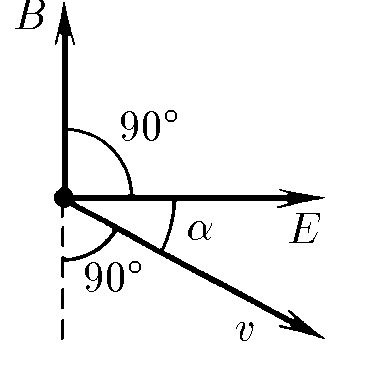

###  Statement

$9.2.1.$ An electric field of strength $E~$ of charges moving with velocity $v$ creates a magnetic field whose induction $\vec{B} = K[\vec{v}\times \vec{E}]$. The coefficient $K$ is equal to $\varepsilon_0 \mu_0$ in SI and $1/c$ in CGS, where $c$ is the speed of light. Prove that the magnetic interaction of two moving charges is weaker than their electrical interaction.

### Proof

Magnetic field, the induction of which

$$
|\vec{B}| = \varepsilon_0 \mu_0\left[\vec{v}\times \vec{E}\right] \le \varepsilon_0 \mu_0vE
$$

then the force of magnetic interaction (Lorentz force) of charges

$$
F_B = |q[\vec{v} \times \vec{B}]| = qvB \le \varepsilon_0 \mu_0 qv^2E
$$

taking into account the force of electrostatic interaction $F_E = qE$, we obtain

$$
\frac{F_B}{F_E} \le \varepsilon_0 \mu_0 v^2 = \frac{v^2}{c^2}
$$

Considering the smallness of the speed $v \ll c$, then

$$
\boxed{\frac{F_B}{F_E} \approx 0}
$$