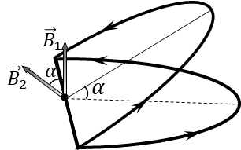

###  Statement 

$9.2.11.$ How many times will the magnetic field induction in the center of a ring with current decrease if it is bent at an angle $\alpha$? The current in the ring does not change. 

### Solution

In [9.2.10](../9.2.10) we obtained an expression for the magnetic induction at the center of the ring $$ B_0 = \frac{\mu_0 I}{2R}\quad(1) $$ Due to superposition, the magnetic induction at the center of one semicircle will be half of this value: $$ B_1 = B_2 = \frac{B_0}{2} = \frac{\mu_0 I}{4R}\quad(2) $$ From the drawing, it is clear that the angle between the vectors $\vec{B}_1$ and $\vec{B}_2$ is equal to $\alpha$ $$ (\vec{B_1},\vec{B_2})=\alpha $$ The total vector of magnetic induction is equal to the vector sum of the components of magnetic induction of two rings $\vec{B}_1$ and $\vec{B}_2$ $$ \vec{B} = \vec{B_1} + \vec{B_2} $$ We will find the modulus of this vector using the cosine law. $$ B = \sqrt{{B_1}^2 + {B_2}^2 - 2B_1 B_2 \cos\alpha} $$ Taking into account the expression $(2)$, we find the total magnetic induction as $$ B= \frac{\mu_0 I}{4R}\sqrt{2-2\cos\alpha} = \frac{\mu_0 I}{2R}\cdot\sin\frac{\alpha}{2}\quad(3) $$ Dividing the expression $(3)$ by $(1)$, we obtain the desired ratio $$ \boxed{\frac{B}{B_0} = \sin\frac{\alpha}{2}} $$ 

#### Answer

$$\frac{B}{B_0} =\sin\frac{\alpha}{2}$$ 
