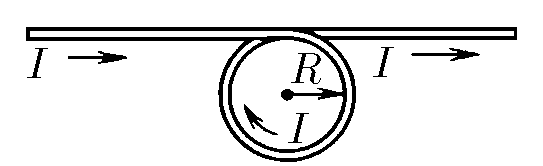

###  Statement 

$9.2.14^*.$ A straight wire has a turn of radius $R$. Current $I$ flows through the wire. Determine the magnetic field induction at the center of the turn and on its axis at a distance $h$ from its center. 

### Solution

Let's split the system into a separate wire and a ring with current with the corresponding fields $B_1 $ and $B_2$

From the school course it is known that the field of an infinite wire $$ B_1 = \frac{\mu_0I}{2\pi l} = \frac{\mu_0 I}{2\sqrt{R^2 + h^2}} $$ We found the ring field in the problem [9.2.10](../9.2.10): $$ B_2 = \frac{\mu_0 I R^2}{2 (R^2 + h^2)^{3/2}} $$ It is worth noting that $\vec{B_1}$ and $\vec{B_2}$ have different directions, the vector $\vec{B_1}$ is perpendicular to the plane of the point and the wire, and the vector $\vec{B_2}$ is directed along the axis. It is easy to show that the cosine of the angle between these vectors $$ \cos\gamma = \frac{R}{\sqrt{R^2+h^2}} $$ тогда 

$$ |\vec B| = |\vec B_1 + \vec B_2| = \sqrt{{B_1}^2+{B_2}^2+2B_1B_2\cos\gamma} $$ 

$$ \boxed{B=\frac{\mu_0I}{2}\left[\frac{1}{\pi^2(R^2+h^2)} + \frac{R^4}{(R^2+h^2)^3} + \frac{2R^3}{\pi (R^2+h^2)^{5/2}}\right]^{1/2}}\tag{1} $$ 

When $h = 0$ we substitute $(1)$ into the expression 

$$ B(0) = \frac{\mu_0I}{2R}\sqrt{\frac{1}{\pi^2} + 1 + \frac{2}{\pi}} \Rightarrow \boxed{B(0) = \frac{\mu_0I}{2\pi R}(1 + \pi)} $$ 

#### Answer

$$B(h)=\frac{\mu_0I}{2}\sqrt{\frac{1}{\pi^2(R^2+h^2)} + \frac{R^4}{(R^2+h^2)^3} + \frac{2R^3}{\pi (R^2+h^2)^{5/2}}}$$ 

$$B(0) = \frac{\mu_0I}{2\pi R}( \pi + 1)$$ 
