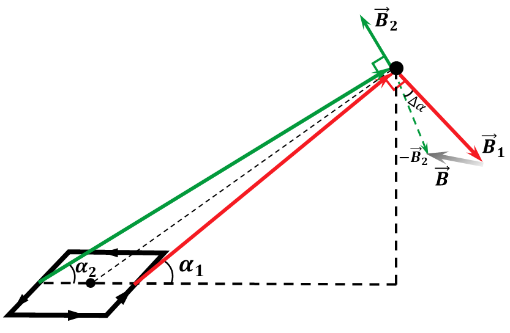
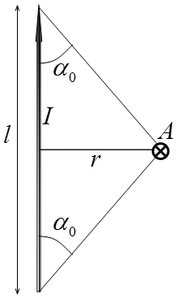

###  Statement 

$9.2.17^*.$ Determine the magnetic field induction of a rectangular frame $a \times b$ with a current $I$ at a point $A$ located at a distance $r$ much greater than the linear dimensions of the frame. The radius vector $\vec{r}$ forms an angle $\alpha$ with the plane of the frame. 

### Solution

From symmetry, it follows that the magnetic field induction will be present only in the plane defined by the angle $\alpha$, since the components of the wire of length $a$ will compensate each other

Let's write out the cosines of the angles that $\vec{r}$ makes with wires of length $b$ let the angle $\alpha_1$ be for the nearest wire, and the angle $\alpha_2$ be for the farthest one, then 

$$ \cos\alpha_1 = \frac{{2r\cos\alpha} - a}{2r} = \cos\alpha - \frac{a}{2r} $$ $$ \cos\alpha_2 = \frac{{2r\cos\alpha} + a}{2r} = \cos\alpha + \frac{a}{2r} $$ __Theoretical digression__

A magnetic wire of length $l$ creates a magnetic field equal to $$ B=\frac{\mu_0I}{2\pi r}\cos\alpha_0 $$ From the geometry of the problem, we obtain $$ \cos\alpha_0 = \frac{b/2}{\sqrt{r^2+b^2/4}} = \frac{b}{2r}\left(1+\frac{b^2}{4r^2}\right)^{1/2} $$ Using the approximation $(1+x)^\alpha\approx1+\alpha x$, we transform to the first order of smallness $$ \cos\alpha_0 = \frac{b}{2r}\left(1-\frac{b^2}{8r^2}\right)\approx\frac{b}{2r} $$ A more detailed derivation of this formula is on pages 76-78 ["Magnetostatics. Electrodynamics. Theory of Oscillations"](http://belpho.org/books/Magnitostatika.pdf) — A.I. Slobodanyuk From where we get $$ \boxed{B_0=B_1=B_2=\frac{\mu_0Ib}{4\pi r^2}} $$ NO: we used an approximation that will later give us an answer with an accuracy of up to first order

From the drawing it follows that the total magnetic induction of the magnetic field $\vec{B}$ will be equal to the vector sum of the components $\vec{B}_1$ and $\vec{B}_2$ $$ \vec{B}=\vec{B}_1+\vec{B}_2 $$ Then the vector modulus can be found using the cosine law. $$ B = \sqrt{B_1^2+B_2^2-2B_1B_2\cos\Delta\alpha} $$ $$ B = B_0\sqrt{2-2\cos\Delta\alpha} = 2B_0\sin\frac{\Delta\alpha}{2}\tag{1} $$ Considering the smallness of the angle $\Delta \alpha$, $$ \sin\frac{\Delta\alpha}{2} \approx \frac{\Delta\alpha}{2}=\frac{a}{2r} $$ We substitute $(1)$: $$ B = 2B_0\sin\frac{\Delta\alpha}{2} = B_0 \Delta\alpha $$ We obtain in approximation to the first order: $$ \boxed{B = \frac{\mu_0Ib}{4\pi r^2}\frac{a}{r} = \frac{\mu_0M}{4\pi r^3}} $$ If, when solving the problem, you managed to get an answer up to the second order, be the first to send the solution to [aliaksandr@melnichenka.com](mailto:aliaksandr@melnichenka.com)

#### Answer

$$B=\mu_0M\sqrt{1+3\sin^2\alpha} /(4\pi r^3), ~M=Iab$$ 
