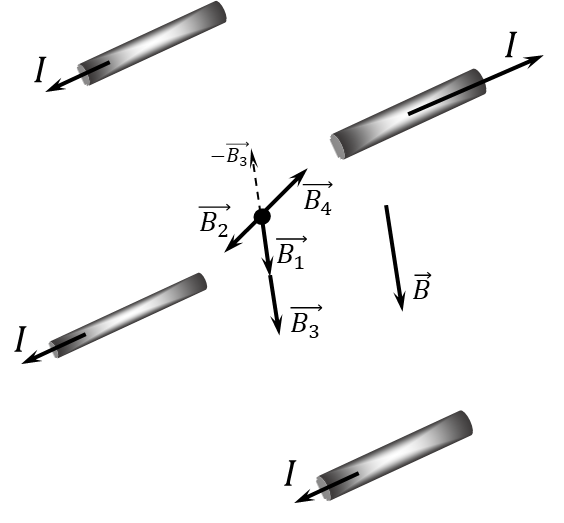

###  Statement 

$9.2.5.$ Each of the four long, straight parallel conductors passing through the vertices of a square (the sides of the square are 30 cm) perpendicular to its plane carries a current of 10 A, with the current flowing in one direction in three conductors and in the opposite direction in the fourth. Determine the magnetic field induction at the center of the square. 

### Solution

The total vector of magnetic induction $\vec{B}$ is found as the sum of the vectors of magnetic induction created by each of the wires $$ \vec{B} = \vec{B_1} + \vec{B_2} + \vec{B_3} +\vec{B_4} $$ Since $\vec{B_2}$ and $\vec{B_4}$ are oppositely directed - equal in magnitude and opposite in direction, then the total magnetic induction vector $\vec{B}$ will be co-directed with $\vec{B_1}$ and $\vec{B_3}$ and equal to the sum of their moduli $$ \vec{B_2} = -\vec{B_4} \Rightarrow \boxed{B = B_1 + B_3 = 2B_1}\tag{1} $$ We find the magnetic induction created by one wire at a distance of $a/\sqrt{2}$ from the center of the square as $$ B_1 = \frac{\mu_0 I}{2\pi\frac{a}{\sqrt{2}}} = \frac{\mu_0 I \sqrt{2}}{2\pi a} $$ Next, we substitute the obtained expression for $B_1$ into the expression $(1)$ for the total induction of the described system $$ \boxed{B = \frac{\mu_0 I \sqrt{2}}{\pi a} = 18.9~\mu T} $$ 

#### Answer

$$B = \frac{\mu_0 I \sqrt{2}}{\pi a} = 18.9~\mu T$$ 
