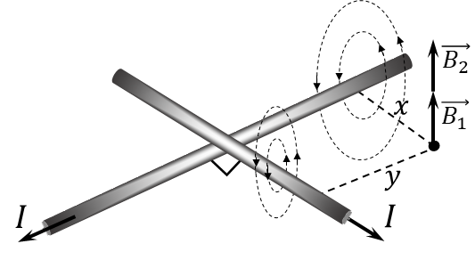

###  Statement

$9.2.6.$ Long straight wires with current intersect at right angles. Determine the magnetic field induction at a point with coordinates $x$ and $y$ if the coordinate axes are the wires and the current in the wires is $I$.

### Solution

We find the total vector of magnetic induction as the sum of the vectors of magnetic induction created by each of the vectors

$$
\vec{B} = \vec{B_1} + \vec{B_2}
$$

Using the right-hand rule, we can determine the direction of the magnetic induction lines and notice that $\vec{B_1}$ and $\vec{B_2}$ are directed perpendicular to the $xy$ plane, which means they are co-directed

$$
\boxed{B=B_1+B_2}\tag{1}
$$

We will find the magnetic induction of each of them as the induction of an infinite single-horned wire.

$$
B_1 = \frac{\mu_0 I}{2\pi} \cdot \frac{1}{x};\quad B_2 = \frac{\mu_0 I}{2\pi} \cdot \frac{1}{y}\tag{2}
$$

We substitute the obtained expression $(2)$ into $(1)$

$$
\boxed{B = {B_1} +{B_2} = \frac{\mu_0 I}{2\pi}\cdot \left(\frac{1}{x}+\frac{1}{y}\right)}
$$

#### Answer

$$
B=\frac{\mu_0 I}{2\pi}\cdot \left(\frac{1}{x}+\frac{1}{y}\right)
$$