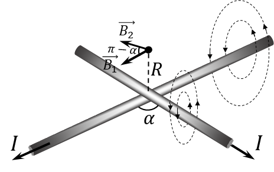

###  Statement 

$9.2.7.$ Long straight wires with current intersect at an angle $\alpha$. Find the magnetic field induction on a straight line passing through the point of intersection of the wires perpendicular to both of them. The current in the wires is $I$. 

### Solution

We find the total vector of magnetic induction as the sum of the vectors of magnetic induction created by each of the vectors $$ \vec{B} = \vec{B_1} + \vec{B_2}\quad(1) $$ According to the right-hand rule, we can determine the direction of the magnetic induction lines and notice that $\vec{B_1}$ and $\vec{B_2}$ lie in the same plane, parallel to the plane of the wires, at an angle of $\pi - \alpha$. Then, the total magnetic induction vector $\vec{B}$ from the expression $(1)$, then when adding through the cosine theorem will be an adjacent angle — $\alpha$ $$ \boxed{B=\sqrt{B_1^2+B_2^2 - 2B_1B_2\cos\alpha}}\quad(2) $$ We will find the magnetic induction of each of them as the induction of an infinite single-horned wire. $$ B_1 = B_2 = \frac{\mu_0 I}{2\pi R}\quad(3) $$ We substitute the obtained expression $(3)$ into $(2)$ and obtain the desired magnetic field induction $$ B = \frac{\mu_0 I}{2\pi R} \sqrt{2-2\cos\alpha} \Rightarrow \boxed{B = \frac{\mu_0 I}{\pi R}\sin\left(\frac{\alpha}{2}\right)} $$ 

#### Answer

$$B = \frac{\mu_0 I}{\pi R}\sin\left(\frac{\alpha}{2}\right)$$ 
