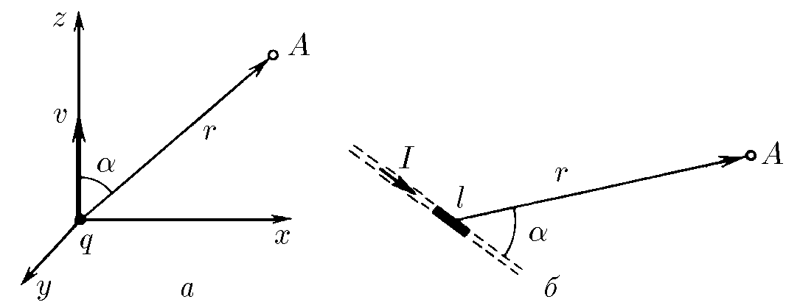

###  Statement

$9.2.8.$ a) Using the formula given in problem [9.2.1](../9.2.1), determine the magnetic induction created by a charge $q$ moving with velocity $v$ at a distance $r$ from this charge. The radius vector $\vec{r}$ forms an angle $\alpha$ with the velocity $v$.

b) Determine the magnetic induction of a straight wire of length $l$ carrying a current $I$ at a distance $r$ from the wire if $l \ll r$. The radius vector $\vec{r}$ forms an angle $\alpha$ with the wire.

### Solution

a) Let's write down the formula given in the problem [9.2.1](../9.2.1),

$$
\vec{B} = \mu_0 \varepsilon_0 [\vec{v} \times \vec{E}] \tag{1}
$$

We will find the current flow rate from [9.2.3](../9.2.3)

$$
v = \frac{I}{\lambda}\tag{2}
$$

Considering that the charge $q = l\lambda$, the electric field strength

$$
E = \frac{l\lambda}{4\pi\varepsilon_0r^2}\tag{3}
$$

We substitute $(2)$ and $(3)$ into $(1)$, and we get the expression

$$
\vec{B} = \mu_0 \varepsilon_0\left[\vec{\left(\frac{I}{\lambda}\right)} \times \frac{l\lambda}{4\pi\varepsilon_0} \cdot \frac{\vec{r}}{r^3}\right] \tag{4}
$$

$$
\vec{B} = \frac{\mu_0 q}{4\pi r^3}[\vec{v} \times \vec{r}]
$$

The modulus of this vector product is

$$
B = \frac{\mu_0 q}{4\pi r^3}vr\cdot \sin\alpha \Rightarrow \boxed{B = \frac{\mu_0 qv}{4\pi r^2}\cdot \sin\alpha}
$$

b) Since $l \ll r$ then the approximation of the thread as a point charge is valid

$$
B = \mu_0 \varepsilon_0 Ev\cdot \sin\alpha
$$

We substitute the expressions $v$ and $E$ from $(2)$ and $(3)$, respectively

$$
B = \mu_0 \varepsilon_0 \frac{l\lambda}{4\pi\varepsilon r^2} \cdot \frac{I}{\lambda}\sin\alpha \Rightarrow \boxed{B=\frac{\mu_0Il}{4\pi r^2}\sin\alpha}
$$

#### Answer

$$
B = \frac{\mu_0 I}{\pi R}\sin\left(\frac{\alpha}{2}\right)
$$