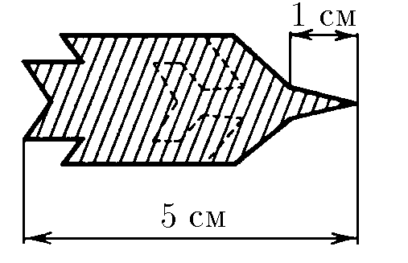

###  Условие:

$ 1.1.1.$ На рисунке$^{*)}$ приведена «смазанная фотография» летящего реактивного самолета. Длина самолета $30 \text{ м}$, длина его носовой части $10 \text{ м}$. Определите по этой «фотографии» скорость самолета. Время выдержки затвора $0.1~\text{с}$. Форма самолета изображена на рисунке штриховой линией.

###  Решение:

Чтобы найти скорость самолета, необходимо определить вектор его перемещения за время $T$, в течение которого затвор фотоаппарата открыт. Выберем на фотографии начальную точку $1$ и определим расстояние, на которое она переместится за время $T$. Из общей длины фотографии необходимо вычесть длину самолета. С учетом масштаба модуль перемещения составит

$$
l=50-30 = 20 \text{ м}
$$

За $0.1\text{ с}$ самолет прошел расстояние $20\text{ м}$, что соответствует скорости

$$
\boxed{v = \frac{l}{T} = 200\text{ м/с}}
$$

#### Ответ: $v = 200~\mathrm{м/с}$

###  Альтернативное решение:

