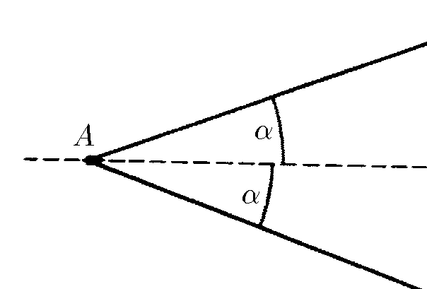
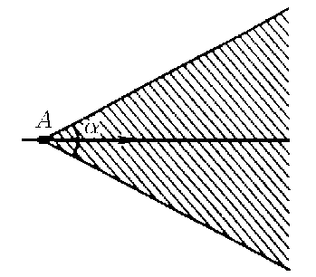

###  Условие:

$1.1.10^{∗}$ По прямому шоссе идет автобус с постоянной скоростью $v$. Вы заметили автобус, когда тот находился в некоторой точке $A$. Из какой области около шоссе вы можете догнать этот автобус, если скорость вашего бега $u < v$? Нарисуйте эту область для $u = v/2$

###  Решение:

Пусть автобус находится в точке $А$, а догоняющий начинает движение из точки $В$ и бежит перпендикулярно дорожному полотну $АС$. Введём обозначения: $АС = L, BC = h, AB = s.$

Из прямоугольного треугольника $АВС$ имеем

$$
L = s \cdot \cos\frac{\alpha}{2}\text{ и }h = s \cdot\sin\frac{\alpha}{2}
$$

Время движения автобуса $t_1$ и пассажира $t_2$ до встречи в точке $С$

$$
{t}_{1}=\frac{{L}}{{v}}=\frac{{s}\cos(\alpha /2)}{{v}};\quad{t}_{2}=\frac{{h}}{{u}}=\frac{{s}\sin(\alpha /2)}{{u}}
$$

откуда

$$
\fbox{$\alpha = 2 \cdot \arctan \frac{u}{v}$}
$$

###  Альтернативное решение:

###  Альтернативное решение:

####  Ответ: Из области, ограниченной углом $\alpha = 2 \,\arcsin (u/v)$ с вершиной в точке $A$, биссектриса которого — шоссе