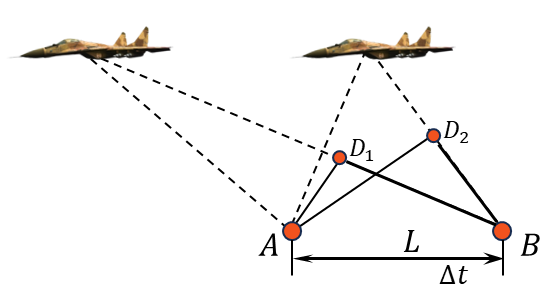

###  Условие:

$1.1.11^{∗}$ . Сверхзвуковой самолет летит горизонтально. Два микрофона, находящиеся на одной вертикали на расстоянии $l$ друг от друга, зарегистрировали приход звука от самолета, пролетающего над микрофонами, с запаздыванием времени $\Delta t$. Скорость звука в воздухе $c$. Какова скорость самолета?

###  Решение:

1\. Чем больше самолёта превосходит скорость скорость звука, тем величина $AD$ меньше, T.e. $v \sim 1/AD$.

2\. Если самолёт летит со звуковой скоростью $v = с$, то $AD = AB = L$, в этом случае треугольник $ADB$ - равносторонний, или

$$
v = c \frac{AB}{AD} = c \frac{L}{AD} \; (1)
$$

3\. Определим элементы треугольника $ADB$

$$
DB = c \cdot \Delta t\text{; }AD = \sqrt{L^2 - DB^2} \; (2)
$$

4\. Подставляя $(2)$ в уравнение $(1)$, получим

$$
{v}=\frac{{cL}}{\sqrt{{L}^{2}-{c}^{2}\Delta{t}^{2}}}.
$$

__NO__: Эта задача связанна с явлением конусом Маха. Об этом явление написано в журнале “Квант”[2010-03.pdf](http://kvant.mccme.ru/pdf/2010/2010-03.pdf) (42 стр.)

####  Ответ:

$$
v = cl/\sqrt{l^{2}-{c}^{2}{\Delta t}^{2}}
$$

###  Альтернативное решение:

###  Альтернативное решение:

