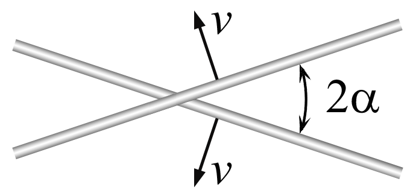
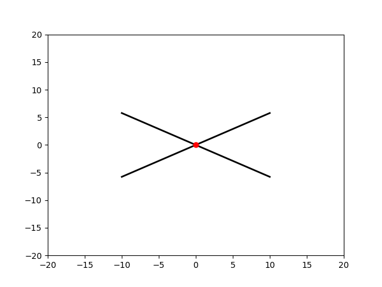
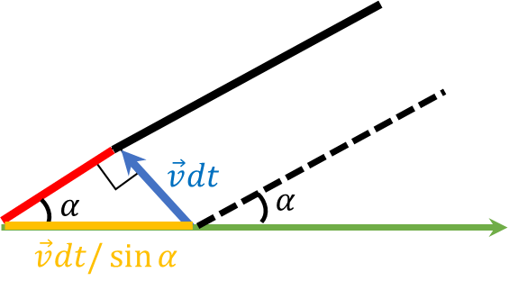

###  Условие: 

$1.1.12^{∗}$ Два стержня пересекаются под углом $2\alpha$ и движутся с равными скоростями $v$ перпендикулярно самим себе. Какова скорость точки пересечения стержней? 

###  Решение: 

 

Как показано на анимации, при движении точка пересечения будет оставаться на биссектресе угла $2\alpha$ между ними 

 

Рассмотрим изменение точки пересечения на горизонтальной оси в течении промежутка времени $dt$ 

Из геометрии прямоугольного треугольника, горизонтальная координата(она же гипотенуза) изменилась на $dx = v dt / \sin\alpha$ 

Откуда скорость: 

$$\fbox{$u = \frac{dx}{dt} = \frac{v}{\sin\alpha}$}$$ 

####  Ответ: 

$$u = v/ \sin\alpha$$

###  Альтернативное решение: 

   

