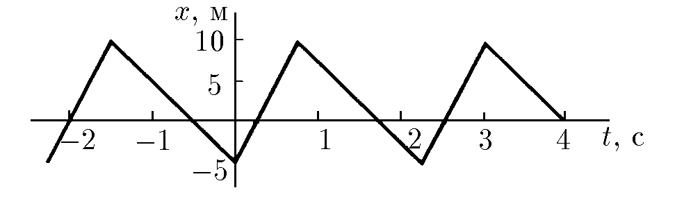
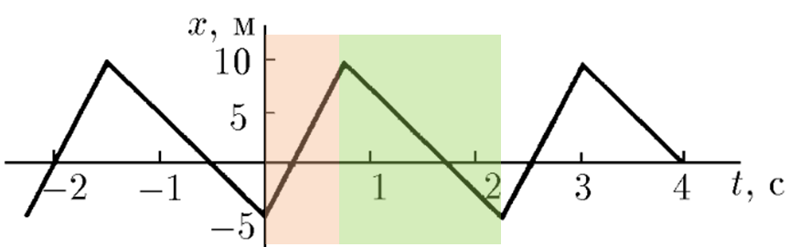
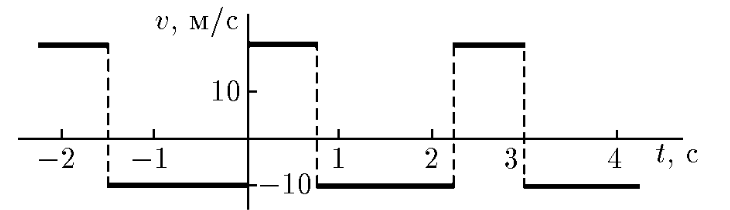

###  Условие:

$1.1.13.$ По графику зависимости координаты от времени постройте график зависимости скорости от времени.

###  Решение:

В данном периодическом движении, можно выделить два скоростных режима: когда скорость положительная и отрицательная.

Исходя, из определения скорости значение скорость в каждом режиме будет $20 \, м/с$ и $10 \, м/с$, соответсвенно:

#### Ответ: см. рисунок