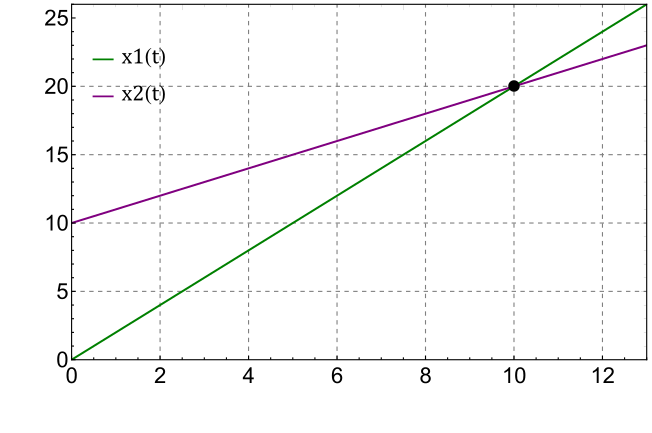

###  Условие: 

$1.1.14.$ Найдите с помощью графиков зависимости координаты от времени момент времени и место соударения частиц, движущихся по одной прямой. Скорость первой частицы $v$, скорость второй $v/2$. Первая частица в момент времени $t = 0$ имела координату $x = 0$, вторая в момент времени $t_{1}$ — координату $x = a.$ 

###  Решение: 

Закон движения первой частицы: 

$x_1(t) = vt \; (1)$ 

Закон движения второй частицы: 

$x_2(t) = \frac{v}{2}(t-t_1) + a$ 

Условие пересечения в момент времени $t_2$: 

$x_1(t_2)=x_2(t_2) \Leftrightarrow vt_2 = \frac{v}{2}(t_2-t_1) + a$ 

Откуда 

$t_2 = \frac{2a}{v} - t_1 \; (2)$ 

Подставляя $(2)$ в $(1)$: 

${x}' = 2a - vt_1$ 

####  Ответ: 

Ордината и абсцисса точки пересечения графиков $x_{1} = vt$ и $x_{2} = a + v(t − t_{1})/2$ дают время и координату точки соударения частиц: $t_2 = (2a − vt_{1})/v, \, {x}' = 2a − vt_{1}$ 

  

