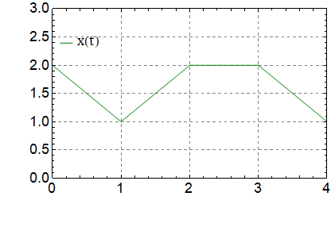
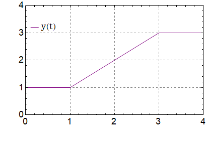

###  Условие: 

$1.1.16.$ Частица движется в одной плоскости. По графикам зависимости от времени проекций $v_x$ и $v_y$ скорости постройте траекторию частицы, если $x(0) = 2 \;м,\; y(0) = 1 \;м$. 

###  Решение: 

Учитывая физический смысл площади под графиком скорости от времени, получаем графики зависимости координаты от времени. 

  
  График зависимости $x(t)$    
  График зависимости $y(t)$ 

Накладывая, график зависимости $x(t)$ и $y(t)$ друг на друга в соответствующие промежутки времени, получаем: 

  Траектория движения 

####  Ответ: см. рис.

  

