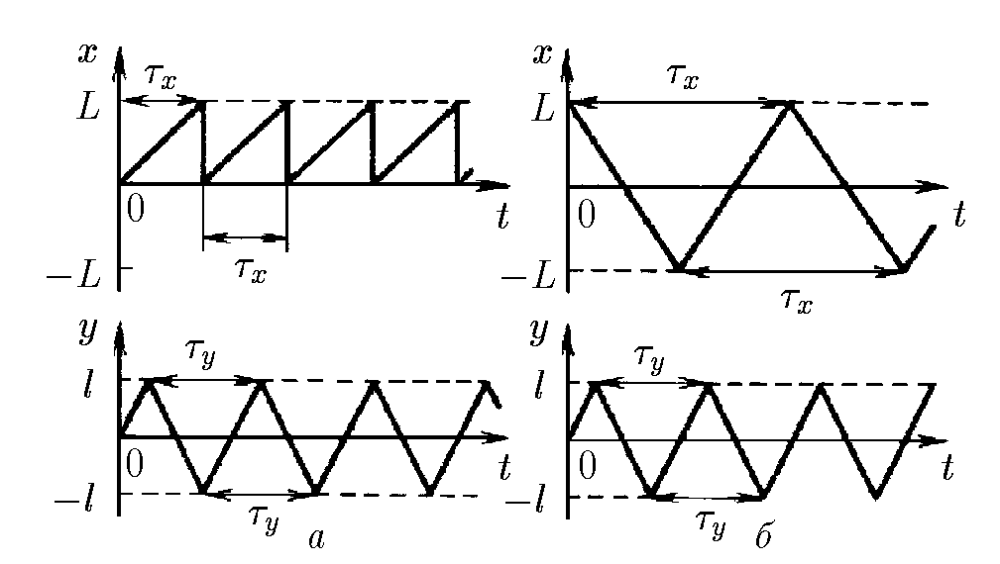
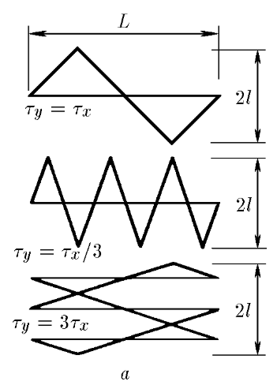

###  Условие: 

$1.1.17.$ Движение луча по экрану осциллографа описывается графиками зависимости координат $x$ и $y$ от времени. Какая картина возникнет на экране при $\tau_y = \tau_x, \; \tau_x/3, \;3\tau_x$? Рассмотрите два случая (см. рисунок). В случае $а$ горизонтальные линии на экране почти не видны. Почему? При каком соотношении $\tau_x$ и $\tau_y$ в случае $б$ траектория луча на экране будет замкнутой? 

###  Решение: 

 

а) возвращение луча по координате $x$ занимает очень малое время, соответственно на единицу длины люминесцирующей поверхности экрана попадает мало электронов. См. рис.

б) при $\tau_y/\tau_x = m/n$, где $m$ и $n$ — любые целые числа. 

    

