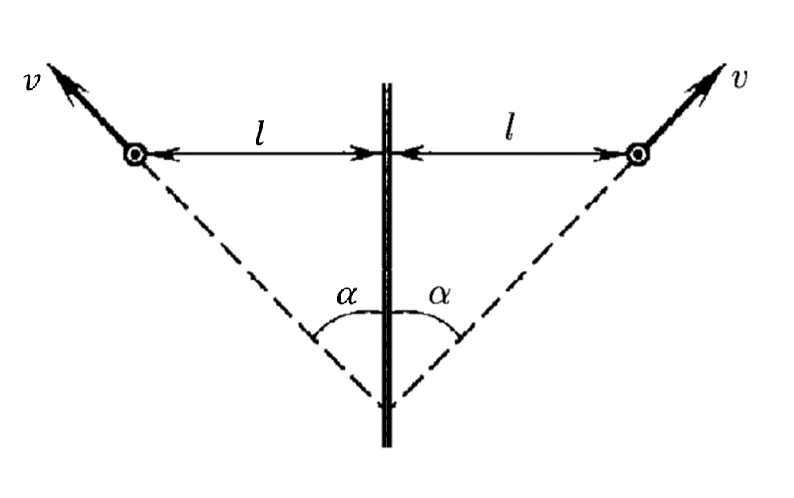
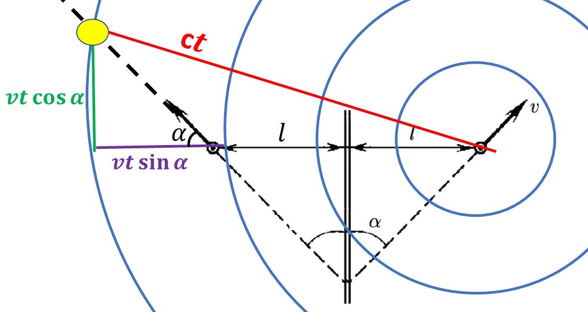

###  Условие:

$1.1.18^*.$ Автомобиль удаляется со скоростью $v$ от длинной стены, двигаясь под углом $\alpha$ к ней. В момент, когда расстояние до стены равно $l$, шофер подает короткий звуковой сигнал. Какое расстояние пройдет автомобиль до момента, когда шофер услышит эхо? Скорость звука в воздухе $c$.

###  Решение:

Т.к. звуковой сигнал от автомобиля сразу отражается от стенки можно зеркально отразить сигнал от автомобиля, как "будто" звуковой сигнал доганяет мнимое изображение движущегося автомобиля

Далее, принимаем тот факт, то что за время $t$, звук проходит расстояние $ct$, а автомобиль расстояние $vt$ вдоль прямой своего движения:

Запишем Теорему Пифагора для получившегося прямоугольного треугольника:

$$
(vt\cos\alpha )^2+(vt\,\sin\alpha + 2l)^2 = c^2t^2
$$

Переписываем квадратное уравнение в виде:

$$
(v^2-c^2)t^2 + 4lvt\,\sin\alpha + 4l^2= 0
$$

Получаем положительный корень:

$$
t=2l\frac{v\;\sin\alpha +\sqrt{c^2-v^2\;\cos^2 \alpha}}{c^2-v^2}
$$

Т.к. расстояние, которое пройдет автомобиль до момента, когда шофер услышит звук равен $x=vt$, то расстояние найдем как:

$$
\fbox{$t=2l\frac{v\;\sin\alpha +\sqrt{c^2-v^2\;\cos^2 \alpha}}{c^2-v^2}$}
$$

####  Ответ:

$$
x=2l\frac{v\;\sin\alpha +\sqrt{c^2-v^2\;\cos^2 \alpha}}{c^2-v^2}
$$

###  Альтернативное решение:

