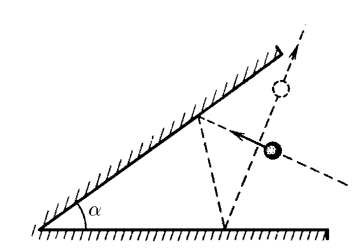
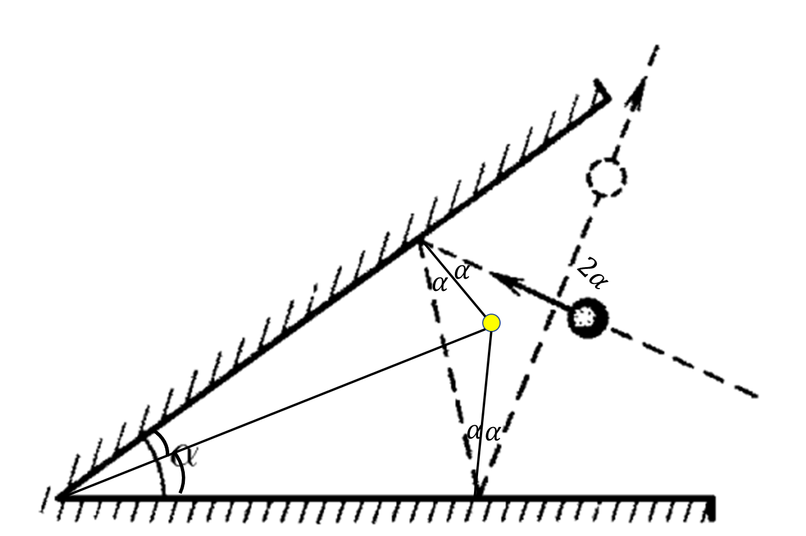

###  Условие: 

$1.1.19.$ На какой угол изменится направление скорости шара после двух упругих ударов о стенки, угол между которыми равен $\alpha$? Как полетит шар, если угол $\alpha = \pi /2$? Движение происходит в плоскости, перпендикулярной стенкам. При упругом ударе о гладкую неподвижную стенку угол падения шара равен углу отражения. 

###  Решение: 

При упругом падении на горизонтальную плоскость, угол падения равен углу отражения. 

Таким образом, направление скорости шара после двух упругих ударов изменится на угол $\beta = 2\alpha$ 

При $\alpha =\pi /2$, $\beta = \pi$, т.е. мяч полетит в противоположном направлении. 

####  Ответ: $\beta = 2\alpha$. В направлении, противоположном начальному 

  

