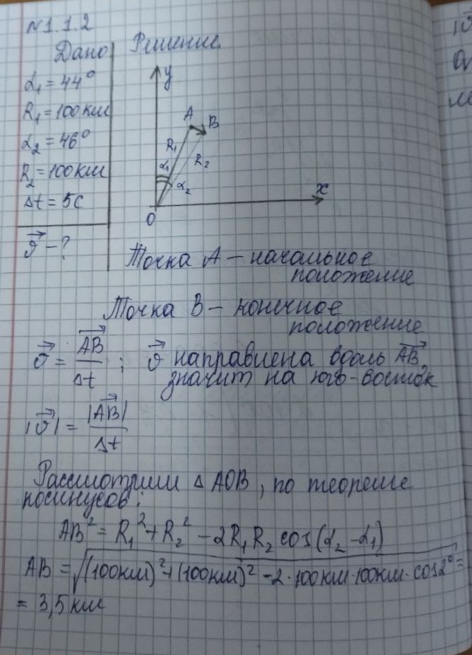
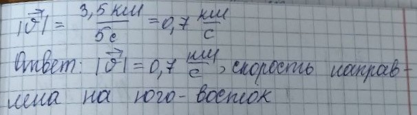

###  Условие:

$1.1.2.$ Радиолокатор определяет координаты летящего самолета, измеряя угол между направлением на Северный полюс и направлением на самолет и расстояние от радиолокатора до самолета. В некоторый момент времени положение самолета определялось координатами: угол $\alpha_1 = 44^{\circ}$, расстояние $R_1 = 100\text{ км}$. Через промежуток времени $5\text{ с}$ после этого момента координаты самолета на радиолокаторе: угол $\alpha_2 = 46^{\circ}$, расстояние $R_2 = 100\text{ км}$. Изобразите в декартовой системе координат с осью $y$, направленной на север, и с радиолокатором в начале координат положение самолета в оба момента времени; определите модуль и направление его скорости. Угол отсчитывайте по часовой стрелке.

###  Решение:

$O_1$ — начальное положение самолета. $O_2$ — конечное положение самолета. За время $t$ самолет пролетит расстояние:

$$
S = v_0 \cdot t
$$

Расстояние $S$ найдем из равнобедренного треугольника $AO_1O_2$, где угол $O_1AO_2 = 2^{\circ}$. Тогда

$$
S = 2R \cdot\sin 1^{\circ}
$$

здесь $R_1 = R_2 = R$.

$$
v_0 \cdot t = 2R \cdot\sin 1^{\circ}
$$

Искомая скорость

$$
v_0 = \frac{2R \cdot\sin 1^{\circ}}{t}
$$

При малом угле $\sin\alpha\approx \alpha$, выраженному в радианах, т.е $1^{\circ} = \frac{\pi}{180}$

$$
v_0 = \frac{2 \cdot 10^5 \cdot \pi}{5 \cdot 180} = 698\text{ м/с}
$$

####  Ответ: $v_0 = 698 \text{ м/с}$, направлением на юго-восток

###  Альтернативное решение:

###  Альтернативное решение:

