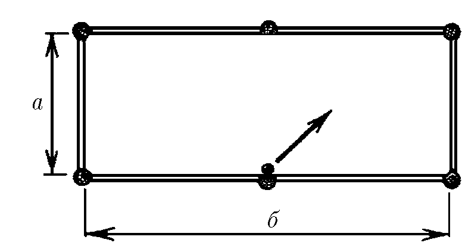
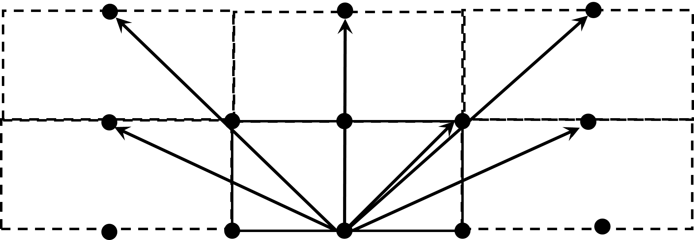

###  Условие: 

$1.1.20^*.$ По биллиардному столу со сторонами $а$ и $б$ пускают шар от середины стороны $b$. Под каким углом к борту стола должен начать двигаться шар, чтобы вернуться в ту же точку, из которой он начал свое движение? 

###  Решение: 

По-аналогии с [1.1.18](../1.1.18), можно воспользоваться Методом Изображений и представить упругие стенки как оптические зеркала. 

  

Чтобы попасть в исходное положение, нужно всего лишь попасть в любую из лунок-изображений. 

Координаты лунок описываются выражением: 

$$x=2ma\text{ и }y=nb,$$

где $m$ и $n$ — любые целые числа 

Откуда искомый угол:

$$\alpha = \arctan (2ma/(nb))$$

####  Ответ: $\tan\alpha = 2ma/(nb)$, где $m$ и $n$ — любые целые числа 

  

