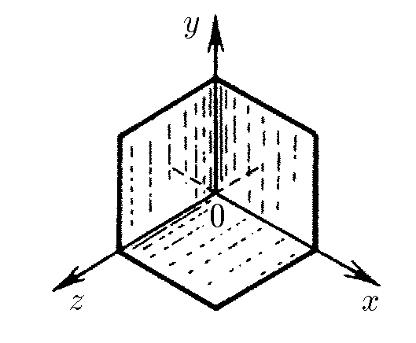

###  Условие:

$1.1.21.$ Уголковый отражатель, установленный на луноходе, представляет собой три взаимно перпендикулярных зеркала. Если на отражатель падает свет, скорость которого $c = (c_x, c_y, c_z)$, то какие составляющие будет иметь скорость света после отражения от зеркала, находящегося в плоскости $yOz$? после отражения от всех трех зеркал?

###  Решение:

$(a)$ Так как зеркало в плоскости $yOz$ отражает луч вдоль оси $Ox$, координата $x$ инвертируется.

Таким образом, если $\vec{c_1}$ - отраженный луч от $\vec{c}$,

$$
\vec{c_1} = (-c_x, c_y, c_z)
$$

$(b)$ Аналогично, зеркала в плоскостях $yOx$ и $xOz$ отражают луч вдоль осей $Oz$ и $Oy$, соответственно:

$$
\vec{c_2} = (c_x, c_y, -c_z),\text{ для }yOx
$$

$$
\vec{c_3} = (c_x, -c_y, c_z),\text{ для }xOz
$$

При отражении от сразу трех зеркал, все компоненты $\vec{c}$ примут свои отрицательные значения:

$$
\vec{c_4} = (-c_x, -c_y, -c_z)
$$