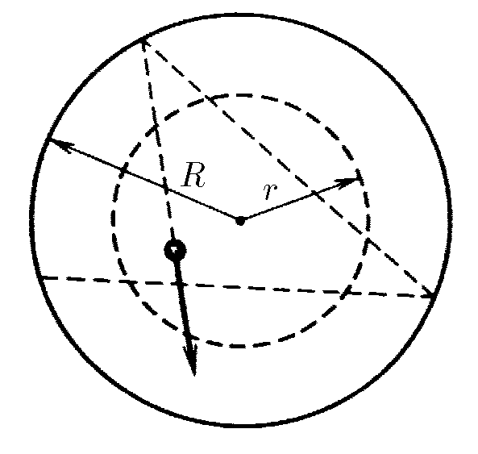
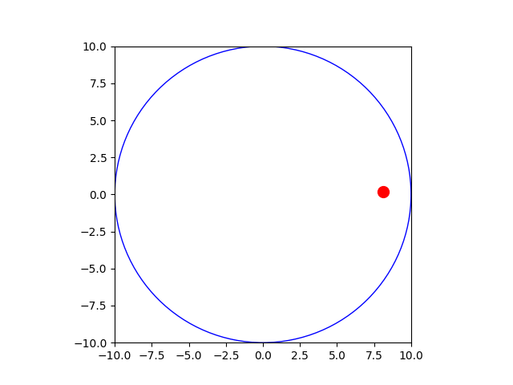
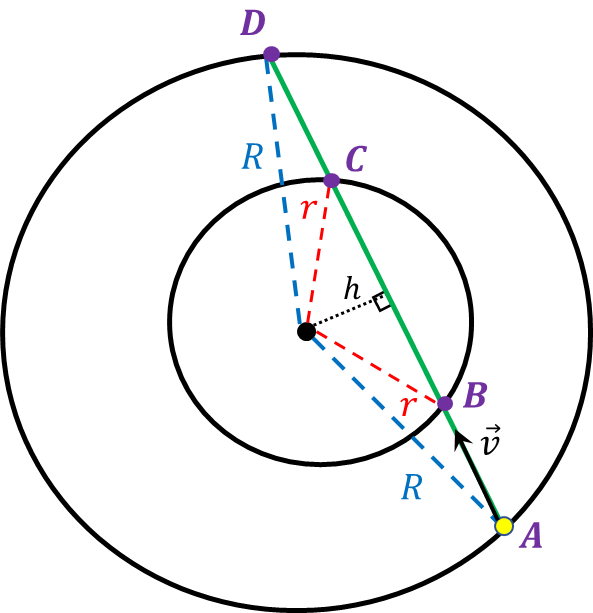

###  Условие: 

$1.1.22.$ Внутри закрепленного гладкостенного цилиндра радиуса $R$ летает маленький шарик, упруго отражаясь от стенок так, что минимальное расстояние от него до оси цилиндра равно $h$. Какую долю времени он находится на расстоянии от оси цилиндра, меньшем $r$, но большем $h$? 

###  Решение: 

  Соударение о стенки цилиндра 

Рассмотрим движени шарика, описаного в условии задачи 

  Путь шарика между соударениями 

Т.к. между соударениями скорость удара не меняется, а удары абсолютно упругие, то можно считать скорость неизменной. Следовательно, за равные промежутки времени тело, проходит равные расстояния. 

Тогда искомое отношение $\frac{\Delta t}{t}$, найдем как отношение $\frac{BC}{AD}$ 

$$\frac{\Delta t}{t} = \frac{BC}{AD}$$ 

По теореме Пифагора: 

$BC = 2 \sqrt{r^2-h^2}$ 

$AD = 2 \sqrt{R^2-h^2}$ 

Отсюда 

$$\frac{BC}{AD} = \frac{\sqrt{r^2-h^2}}{\sqrt{R^2-h^2}}$$ 

Или 

$$\frac{\Delta t}{t} = \frac{\sqrt{r^2-h^2}}{\sqrt{R^2-h^2}}$$ 

####  Ответ: $\Delta t/t=\sqrt{(r^2-h^2)/(R^2-h^2)}$ 

  

