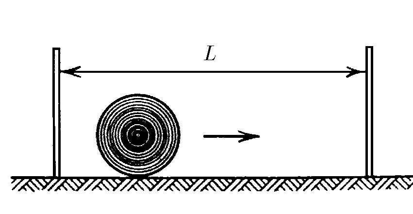
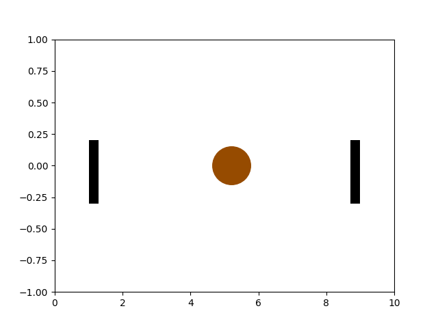
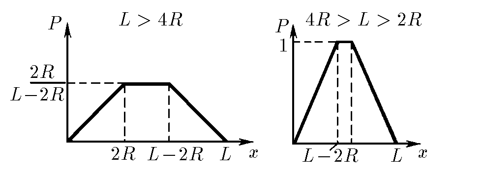

###  Условие:

$1.1.23^*.$ Стрелок пытается попасть в диск радиуса $R$, который движется от одной стенки к другой с постоянной по модулю скоростью так быстро, что за ним нельзя уследить. Нарисуйте график зависимости вероятности попадания пули в диск от расстояния между точкой прицеливания и левой стенкой.

Выстрелы производятся на высоте $R$ от пола перпендикулярно направлению движения диска. В какой точке прицеливания вероятность попадания наименьшая? Наибольшая? Чему они равны? Разберите случаи $L > 4R, \;4R > L > 2R,$ где $L$ — расстояние между стенками.

###  Решение:

При движении мишени, стороний наблюдатель реже всего видит мишень именно скраю, т.к. она там остается меньшее время.

Таким образом максимальная вероятность будет наблюдаться на интервале:

$$
\left\\{\begin{matrix} 0 \leq x < 2R\\\ L-2R < x \leq L \end{matrix}\right.
$$

Т.к. скорость мишени постоянна, а нахождение мешени в диапазоне $2R \leq x \leq L-2R$ равновероятно, то вероятность нахождения в этом диапазоне равна отношению диаметра к длине этого диапазона: $\frac{2R}{L-2R}$.

Графики соответсутсвующие данным режимам:

####  Ответ:

См. рис. Нулевая у стенок. Наибольшая в любом месте на расстоянии от стенок, большем $2R$, и равная $2R/(L−2R)$ при $L > 4R$; в любом месте на расстоянии от стенок, большем $L − 2R$, и равная единице при $4R > L > 2R$