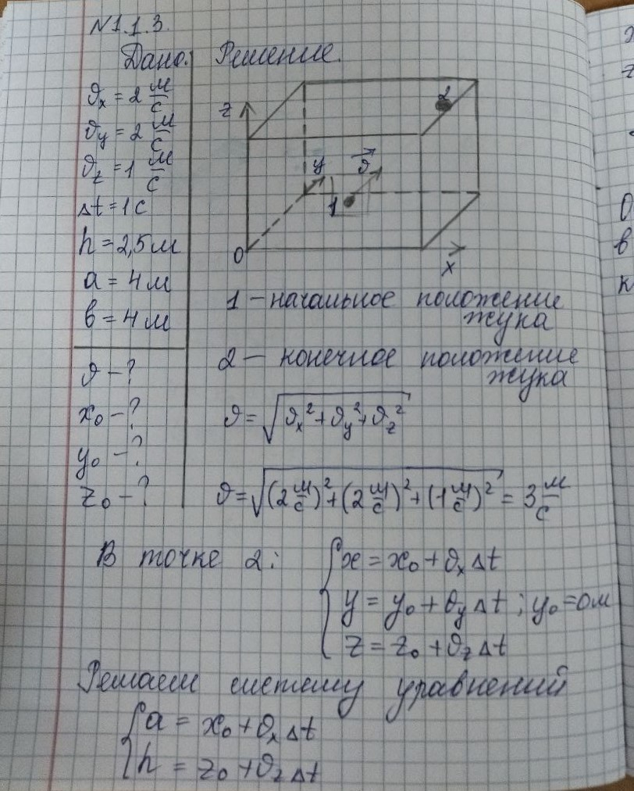
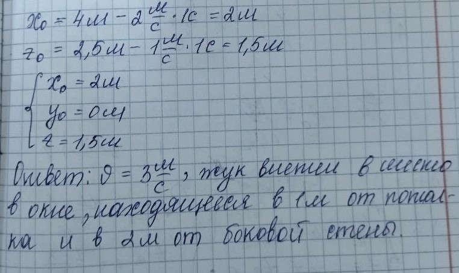

###  Условие:

$1.1.3.$ Через открытое окно в комнату влетел жук. Расстояние от жука до потолка менялось со скоростью $1\text{ м/с}$, расстояние до стены, противоположной окну, менялось со скоростью $2\text{ м/с}$, до боковой стены — со скоростью $2\text{ м/с}$. Через $1\text{ с}$ полета жук попал в угол между потолком и боковой стеной комнаты. Определите скорость полета жука и место в окне, через которое он влетел в комнату. Высота комнаты $2.5\text{ м}$, ширина $4\text{ м}$, длина $4\text{ м}$.

###  Решение:

Пусть жук попадает в угол $B$. Известно, что через одну секунду полета жук попал в т. $B$, значит, форточка находится на расстоянии $1\text{ м}$ от потолка, т. к. по отношению к потолку его скорость изменялась на $1\text{ м/с}$.

По отношению к боковой стенке его скорость изменялась на $2\text{ м/с}$. Следовательно, он влетел на расстоянии $2\text{ м}$ от боковой стенки. Точка $A$ место влета жука в комнату.

Координаты т. $A$ $1\text{ м}$ от потолка и $2\text{ м}$ от боковой стенки. Зная изменение скоростей по трем направлениям $XYZ$, найдем скорость полета жука:

$$
v = \sqrt{v_x^2 + v_y^2 + v_z^2}, \tag{1}
$$

Подставим значения проекций скоростей в $(1)$

$$
v = \sqrt{2^2 + 2^2 + 1^2} = 3 ~\mathrm{\frac{м}{c}}
$$

#### Ответ:

Жук влетел в комнату в т. $А$, находящейся на расстоянии $1$ м от потолка и $2$ м от боковой стенки со скоростью $3\, м/с$

###  Альтернативное решение:

###  Альтернативное решение:

