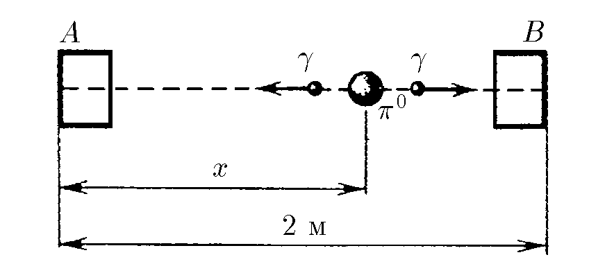

###  Условие:

$1.1.4.$ Счетчики $A$ и $B$, регистрирующие момент прихода $\gamma$-кванта, расположены на расстоянии $2 \, м$ друг от друга. В некоторой точке между ними произошел распад $\pi^{0}$ -мезона на два $\gamma$-кванта. Найдите положение этой точки, если счетчик $A$ зарегистрировал $\gamma$-квант на $10^{−9}$ с позднее, чем счетчик $B$. Скорость света $3\cdot 10^{8} \, м/с$

###  Решение:

1\. Введём следующие обозначения

$$
x_B=L-x
$$

$$
t_A=t_B+\Delta t
$$

2\. Время полёта $\gamma$-кванта до счётчиков

$$
t_B+\Delta t=\frac{x}{c}
$$

$$
t_B=\frac{L-x}{c}
$$

3\. Решая уравнения совместно, получим

$$
\frac{L-x}{c} + \Delta t = \frac{x}{c}
$$

$$
x= \frac{L+c\Delta t}{2}=1.15\,м
$$

#### Ответ:

На расстоянии $1.15 \, м$ от счетчика $A$

###  Альтернативное решение:

