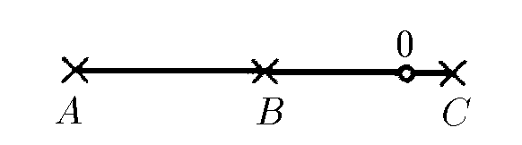

###  Условие: 

$1.1.5^*.$ Три микрофона, расположенные на одной прямой в точках $A$, $B$, $C$, зарегистрировали последовательно в моменты времени $t_A > t_B > t_c$ звук от взрыва, который произошел в точке $O$, лежащей на отрезке $AC$. Найдите отрезок $AO$, если $AB = BC = L$. В какой момент времени произошел взрыв? 

###  Решение: 

Пусть взрыв произошел в момент времени $t_0$, тогда время регистрации сигнала в точке $A$ равно: 

$$t_A = t_0 + \frac{L + x}{c}, \tag{1}$$ 

где $x = BO$. Аналогично для точки $B$ 

$$t_B = t_0 + \frac{x}{c}, \tag{2}$$ 

Для точки $C$ 

$$t_C = t_0 + \frac{L - x}{c}, \tag{3}$$ 

Из первого уравнения вычтем второе: 

$$t_A – t_B = \frac{L}{c}. \tag{4}$$ 

А из первого уравнения вычтем третье 

$$t_A – t_C = \frac{2x}{c}. \tag{5}$$ 

Из $(4)$ уравнения выразим $c = \frac{L}{t_A – t_B}$, а из $(5)$ $x = \frac{t_A – t_C}{2} \cdot c$, Тогда искомое расстояние 

$$AO = L + x = L + \frac{t_A – t_C}{2}\frac{L}{t_A – t_B}$$ 

После преобразования 

$$AO = \frac{3t_A – 2t_B – t_C}{2(t_A – t_B)} \cdot L. \tag{6}$$ 

Для определения момента времени в который произошел взрыв, подставим в выражение 

$$t_A = t_0 + \frac{L + x}{c}, \; c = \frac{L}{t_A – t_B}$$ $$\frac{t_A – t_C}{2} = \frac{x}{c}$$ 

после преобразований 

$$t_0 = t_B - \frac{1}{2} \cdot (t_A – t_C)$$ 

####  Ответ: 

$$AO = \frac{3t_A – 2t_B – t_C}{2(t_A – t_B)} \cdot L, \; t_0 = t_B - \frac{1}{2} \cdot (t_A – t_C)$$

###  Альтернативное решение: 

 

###  Альтернативное решение: 

 

  

