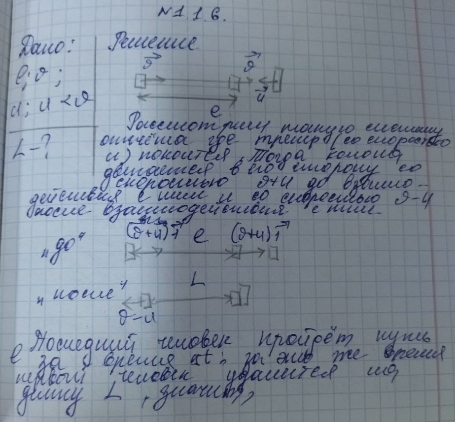
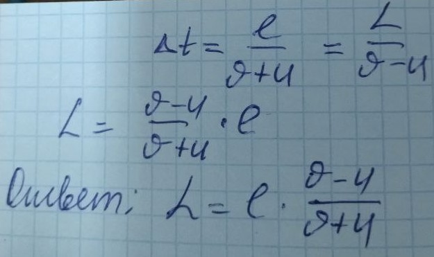

###  Условие: 

$1.1.6.$ Спортсмены бегут колонной длины $l$ со скоростью $v$. Навстречу бежит тренер со скоростью $u < v$. Каждый спортсмен, поравнявшись с тренером, разворачивается и начинает бежать назад с той же по модулю скоростью $v$. Какова будет длина колоны, когда все спортсмены развернуться. 

###  Решение: 

Мысленно остановим колону, тогда тренер кроме своей скорости будет иметь скорость колонны, направленную в противоположную сторону. С этой относительной скоростью $v + u$ он в течение времени 

$$t = \frac{l}{v + u}$$ 

пробежит вдоль колонны и сравняется с хвостом. Голова колоны, развернувшись, будет двигаться с относительной скоростью $v - u$ и через время 

$$t = \frac{{l}'}{v - u}$$ 

где ${l}'$ – длина новой «колоны» после обгона. Тогда 

$$\frac{{l}'}{v - u} = \frac{l}{v + u}$$ 

и длина новой колонны 

$$\fbox{${l}' = \frac{v - u}{v + u}l$}$$ 

####  Ответ: 

Когда все спортсмены развернуться длина новой колоны будет равна ${l}' = \frac{v - u}{v + u}l$

###  Альтернативное решение: 

  

###  Альтернативное решение: 

   

