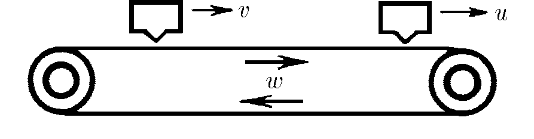

###  Условие:

$1.1.8.$ Лента транспортера имеет скорость $w$. Над лентой движется автомат, выбрасывающий $\nu$ шариков в единицу времени. Шарики прилипают к ленте. Счетчик шариков с фотоэлементом считает только шарики, прошедшие непосредственно под ним. Сколько шариков сосчитает счетчик за единицу времени, если скорость автомата $v < w$, скорость счетчика $u < w$?

###  Решение:

1\. Если автомат и счётчик покоятся, T.e. $v=u=0$, то счётчик за время $\Delta t$ зарегистрирует $N_0$, шариков

$$
N_0 = \nu\Delta t
$$

2\. Если автомат покоится ($v = 0$), a счётчик движется со скоростью $u$, то число регистрируемых частиц составит

$$
N_1 = \nu\frac{w-u}{w+v} \Delta t
$$

3\. При движении автомата и счётчика число частиц за время $\Delta t$ определится как

$$
N_2 = \nu\frac{w-u}{w-v} \Delta t
$$

в единицу времени

$$
n = \nu\frac{w-u}{w-v}
$$

#### Ответ:

$$
{\nu }' = \nu \frac{w − u}{w − v}
$$

###  Альтернативное решение:

