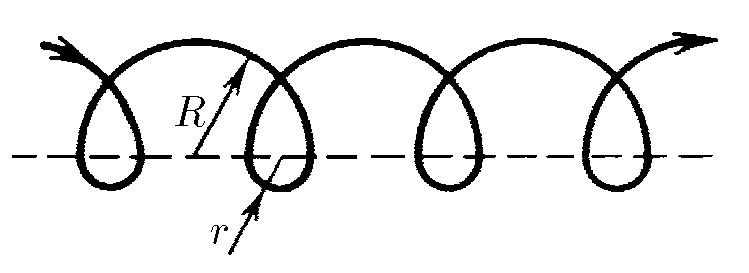

###  Условие: 

$1.2.1.$ На рисунке изображена траектория электрона, который дрейфует вдоль плоскости раздела областей с различными магнитными полями. Его траектория состоит из чередующихся полуокружностей радиуса $R$ и $r$. Скорость электрона постоянна по модулю и равна $v$; найдите среднюю скорость электрона за большой промежуток времени. 

###  Решение: 

Рассмотрим движение электрона от точки $ A $ до точки $ B $. В этих точках электрон находится в равной «фазе». Последующее движение электрона будет повторяться. 

Перемещение электрона вдоль линии раздела областей 

$ S = N \cdot (2R - 2r) $. 

Затраченное время равно сумме 

$$ t = N \cdot \left( \frac{\pi R}{v} + \frac{\pi r}{v} \right) = N \cdot \frac{\pi}{v} \cdot (R + r) $$ 

Средняя скорость электрона за большой промежуток времени 

$$ v_{ср} = \frac{S}{t} = \frac{N \cdot 2(R - r)}{N \cdot \frac{\pi}{v}(R + r)} $$ 

после преобразования 

$$\fbox{$v_{ср} = \frac{2}{\pi} \cdot v \cdot \frac{R - r}{R + r}$}$$ 

####  Ответ: $ v_{ср} = \frac{2}{\pi} v \frac{R - r}{R + r} $, направлена по границе раздела 

  

