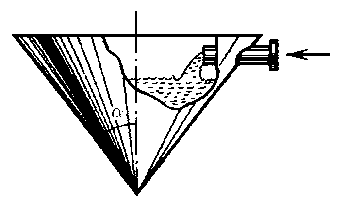
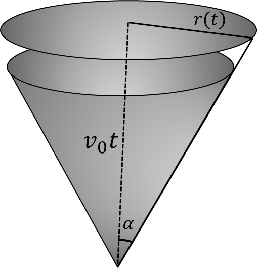

###  Условие:

$1.2.11^*.$ $а$. В коническом сосуде уровень воды поднимается с постоянной скоростью $v_0$. Как зависит от времени скорость поступления воды в сосуд через трубку сечения $s$? В нулевой момент времени сосуд пуст.

$б$. Струя масла, попадающая на поверхность воды, растекается по ней круглым пятном толщины $h$. Как зависит от времени скорость движения границы пятна, если в единицу времени поступает объем масла $q$? В начальный момент времени радиус пятна равен нулю.

###  Решение:

$a)$ К моменту времени $t$, уровень воды будет равен $v_0t$. А скорость изменения объема будет равна:

$$
\frac{dV}{dt} = \frac{\pi r(t)^2 dx}{dt}
$$

Где $dx$ - изменение уровня воды:

$$
\frac{dV}{dt} = \pi r(t)^2 v_0
$$

Из геометрии,

$$
r(t) = v_0 t \cdot \tan\alpha
$$

По определению, скорость поступающей воды равна $v = \frac{dV}{sdt}$

Подставляя предыдущие выражения:

$$
v = {\pi v_0^3 t^2 \cdot \tan^2(\alpha )}/s
$$

$б)$ За малый промежуток времени $dt$ объем изменяется на $dV = q dt$

Также приращение объема можно расписать как

$$
dV = 2\pi r dr \cdot h
$$

Таким образом:

$$
q dt = 2\pi r dr \cdot h
$$

Учитывая $v = \frac{dr}{dt}$,

$$
\fbox{$v = \frac{q}{2\pi r h}$}
$$

#### Ответ:

а. $v=\frac{\pi v_0^3t^2\operatorname{tg}^2\alpha}{s}$; б. $v=\frac{1}{2}\sqrt{\frac{q}{\pi ht}}$