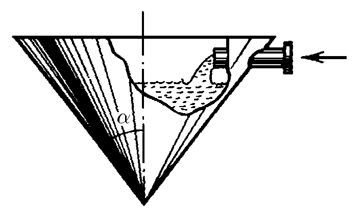
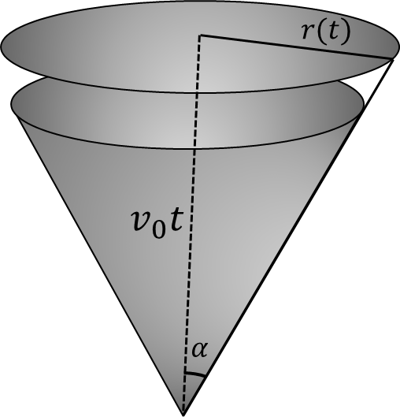

###  Условие:

$1.2.11^*.$ $а$. В коническом сосуде уровень воды поднимается с постоянной скоростью $v_0$. Как зависит от времени скорость поступления воды в сосуд через трубку сечения $s$? В нулевой момент времени сосуд пуст.

$б$. Струя масла, попадающая на поверхность воды, растекается по ней круглым пятном толщины $h$. Как зависит от времени скорость движения границы пятна, если в единицу времени поступает объем масла $q$? В начальный момент времени радиус пятна равен нулю.

###  Решение:

$a)$ К моменту времени $t$, уровень воды будет равен $v_0t$. А скорость изменения объема будет равна:

$$
\\frac{dV}{dt} = \\frac{\\pi r(t)^2 dx}{dt}
$$

Где $dx$ - изменение уровня воды:

$$
\\frac{dV}{dt} = \\pi r(t)^2 v_0
$$

Из геометрии,

$$
r(t) = v_0 t \\cdot \\tan\\alpha
$$

По определению, скорость поступающей воды равна $v = \\frac{dV}{sdt}$

Подставляя предыдущие выражения:

$$
v = {\\pi v_0^3 t^2 \\cdot \\tan^2(\\alpha )}/s
$$

$б)$ Так как пятно представляет собой циллиндр высотой $h$:
$$
V(t) = \\pi R^2(t)h
$$
С другой стороны, поскольку в начальный момент времени радиус, а следовательно и объём, равнялся нулю, то:
$$
V(t) = qt
$$
Приравнивая выражения получаем:
$$
\\pi R^2(t)h = qt
$$

$$
R^2(t) = \\frac{qt}{\\pi h}
$$

$$
R(t) = \\sqrt{\\frac{qt}{\\pi h}}
$$

Зависимость скорости движения границы пятна от времени $v(t)$ есть производная зависимости радиуса пятна от времени $R(t)$:

$$
v(t) = R'(t)
$$

$$
v(t) = \\frac{1}{2\\sqrt{\\frac{qt}{\\pi h}}}\\cdot\\frac{q}{\\pi h}
$$

$$
v(t) = \\frac{1}{2}\\frac{\\sqrt{\\pi h}}{\\sqrt{q}\\cdot\\sqrt{t}}\\cdot\\frac{(\\sqrt{q})^2}{(\\sqrt{\\pi h})^2}
$$

Сократив соответсвующие корни, получаем:

$$
\\boxed{v(t) = \\frac{1}{2}\\sqrt{\\frac{q}{\\pi ht}}}
$$

###  Альтернативное решение (пункт а):

Пусть $V$ - объём воды в сосуде в данный момент времени. Тогда:
$$
V(t) = \\frac{1}{3}\\pi R^2(t) h(t) \\tag{1}
$$

Поскольку уровень воды поднимается с постоянной скоростью $v_0$:
$$
h(t) = v_0t 
$$

В прямоугольном треугольнике, гипотенуза которого - образующая конуса, а катеты - высота $h(t)$ и радиус $R(t)$ соответственно:
$$
\\operatorname{tg}\\alpha = \\frac{R(t)}{h(t)}
$$

$$
R(t) = h(t)\\cdot \\operatorname{tg}\\alpha = v_0t\\cdot \\operatorname{tg}\\alpha
$$

Подставив занчения $R(t)$ и $h(t)$ в $(1)$ получаем:
$$
V(t) = \\frac{1}{3}\\pi v_0^3t^3\\operatorname{tg}^2\\alpha \\tag{2}
$$

Пусть за небольшой промежуток времени $\\Delta t$ объём изменился на величину $\\Delta V$. Тогда скорость поступления воды через трубку на протяжении данного промежутка времени $v(t)$ можно считать постоянной:
$$
\\Delta V = v(t)\\Delta t S \\tag{3}
$$

С другой стороны, из формулы $(2)$ следует:
$$
\\Delta V = V(t+\\Delta t) - V(t)
$$
$$
\\Delta V = \\frac{1}{3}\\pi v_0^3\\operatorname{tg}^2\\alpha[(t+\\Delta t)^3-t^3] \\tag{4}
$$

Выражение в скобках:
$$
(t+\\Delta t)^3-t^3 =
$$
$$
= (t + \\Delta t - t)((t+\\Delta t)^2 + t(t+\\Delta t)+t^2) =
$$
$$
 = \\Delta t(t^2+2t\\Delta t+\\Delta t^2+t^2+t\\Delta t+t^2) =
$$
$$
= \\Delta t(3t^2+3t\\Delta t+\\Delta t^2)
$$

Величиной $\\Delta t^2$ по сравнению с другими можно пренебречь:
$$
\\Delta t(3t^2+3t\\Delta t) = \\Delta t \\cdot 3t(t+\\Delta t)
$$
Величиной $\\Delta t$ по сравнению с $t$ можно пренебречь: 
$$
3\\Delta t\\cdot t\\cdot t=3t^2\\Delta t
$$

Возвращаясь к выражению $(4)$:

$$
\\Delta V = \\frac{1}{3}\\pi v_0^3\\operatorname{tg}^2\\alpha \\cdot 3t^2\\Delta t
$$
$$
\\Delta V = \\pi v_0^3t^2\\operatorname{tg}^2\\alpha\\Delta t
$$

Приравняв полученное к выражению $(3)$:
$$
v(t)\\Delta t S = \\pi v_0^3t^2\\operatorname{tg}^2\\alpha\\Delta t
$$

Наконец, разделив левую и правую часть на $\\Delta t \\cdot S$, получаем:
$$
\\boxed{v(t) = \\frac{\\pi v_0^3t^2\\operatorname{tg}^2\\alpha}{s}}
$$

#### Ответ:

а. $v=\\frac{\\pi v_0^3t^2\\operatorname{tg}^2\\alpha}{s}$; б. $v=\\frac{1}{2}\\sqrt{\\frac{q}{\\pi ht}}$

