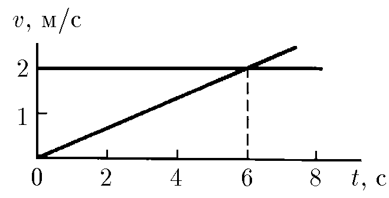
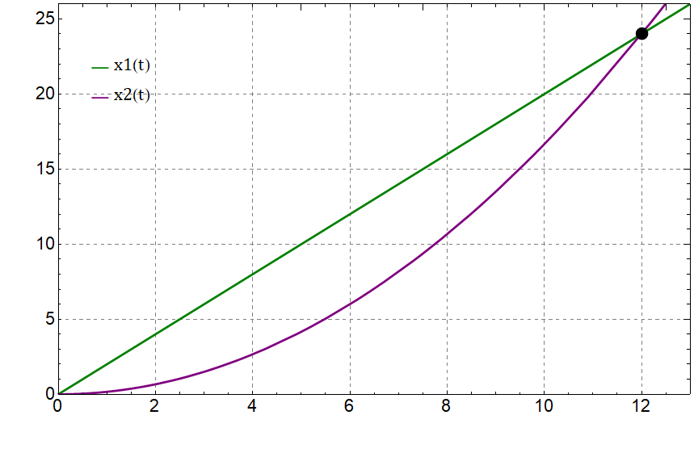

###  Условие:

$1.2.2.$ Две частицы в момент времени $t = 0$ вышли из одной точки. По графикам зависимости скорости от времени определите координаты и время новой встречи частиц.

###  Решение:

1\. Уравнения движения частиц.

$$
{x_{1}(t) = v_{1}t, \quad x_{2}(t) = \frac{at^2}{2}}
$$

2\. Скорость первой частицы и ускорение второй частицы определяются по заданной зависимости $v = f(t)$:

$$
{v_{1} = 2\; \frac{м}{с}}, \quad a \equiv 0.33~\mathrm{\frac{м}{с^{2}}}.
$$

3\. Условие встречи частиц:

$$
x_{1}(t_{z}) = x_{2}(t_{z}). \quad t_{z} = \frac{2v_{z}}{a} = 12\; с, \quad x_{z} = 24\; м.
$$

####  Ответ: Из области, ограниченной углом $\alpha = 2 \, \arcsin \frac{u}{v}$ с вершиной в точке $A$, биссектриса которого — шоссе