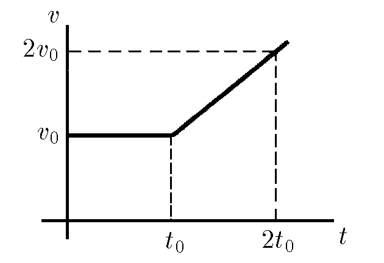

###  Условие: 

$1.2.3.$ Тело в течение времени $t_{0}$ движется с постоянной скоростью $v_{0}$. Затем скорость его линейно нарастает со временем так, что в момент времени $2t_{0}$ она равна $2v_{0}$. Определите путь, пройденный телом за время $t > t_{0}$. 

###  Решение: 

В момент времени $t_0$ координаты равнялась $x_1=v_0t_0$. 

На промежутке от $t_0$ до $2t_0$ ускорение постоянно и равно $a=\frac{v_0}{t_0}$. 

При равноускоренном движении с начальной скоростью $v_0$ с момента времени $t_0$, путь найдем как 

$$ x_2 = v_0 (t-t_0)+\frac{a(t-t_0)^2}{2} $$ 

$$ x = x_1+x_2 $$ 

$$ x = v_0 t+\frac{a(t-t_0)^2}{2} $$ 

####  Ответ: $L = v_{0}t + \frac{v_{0} (t − t_{0})^{2}}{2t_{0}}.$ 

  

