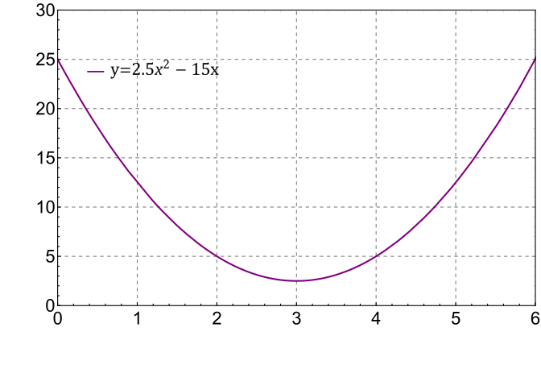

###  Условие: 

$1.2.4.$ Нарисуйте график зависимости координаты от времени для прямолинейного движения, удовлетворяющего одновременно двум условиям: 
а) средняя скорость в промежутке времени от $2$ до $6$ с равна $5$ м/с; 
б) максимальная скорость в том же промежутке равна $15$ м/с. 

###  Решение: 

Нужно подобрать такую, зависимость чтобы производная координаты по времени, она же скорость, подчинялась условиям задачи. 

Пример такой функции указан снизу: 

Производная $x(t) = 2.5t^2-15t$ равна: 

$$v(t) = 5t-15$$ 

Что удовлетворяет, условиям задачи. 

####  Ответ: Любой график с изменением координаты за указанное время на $20$ м и с наибольшим «наклоном» касательной $15$ м/с 

  

