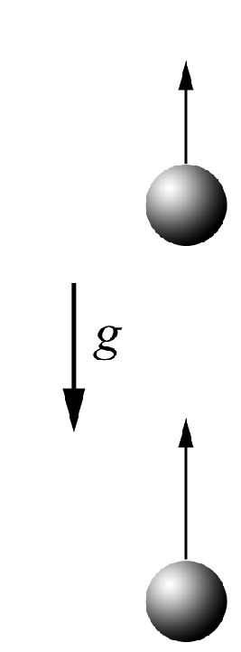

###  Условие: 

$1.3.1.$ Из одной и той же точки вертикально вверх с интервалом времени $\Delta t$ выброшены два шарика со скоростью $v$. Через какое время после вылета второго шарика они столкнутся? 

###  Решение: 

Скорость первого шарика через промежуток времени $\Delta t$: 

$$v_0 = v - g \Delta t$$ 

Относительная скорость 1 и 2-го шариков будет оставаться постоянной и равной: 

$$v_{отн} = g \Delta t$$

Между, тем за время $\Delta t$, 1-й шарик поднялся на высоту 

$$L = v_0 \Delta t - \frac{g \Delta t^2}{2}$$ 

Время, через которое они столкнуться найдем как: 

$$t = \frac{L}{v_{отн}}$$ 

$$\fbox{$t = \frac{v}{g} - \frac{\Delta t}{2}$}$$ 

####  Ответ: $t = v/g − \Delta t/2$ 

  

