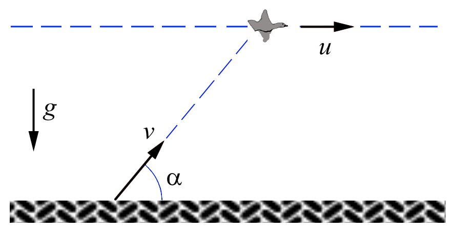
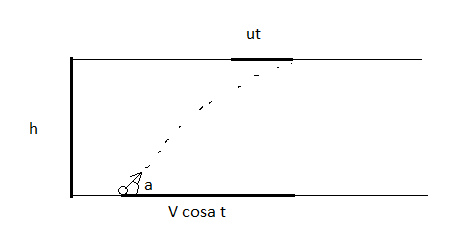

###  Условие:

$1.3.10.$ Утка летела по горизонтальной прямой с постоянной скоростью $u$. В нее бросил камень неопытный «охотник»,причем бросок был сделан без упреждения, т.е. в момент броска скорость камня $v$ была направлена как раз на утку под углом $\alpha$ к горизонту. На какой высоте летела утка, если камень всеже попал в нее?

###  Решение:

Рассмотрим данное уравнение движения:

$$
y = h = \nu\sin\alpha - \frac{gt^{2}}{2}
$$

Известно, что:

$$
\left\\{\begin{matrix} S_{yt}=ut \\\ S_{o}=\nu t \cos\alpha \end{matrix}\right.
$$

Для угла $\alpha$:

$$
\tan\alpha = \frac{h}{S_{o} - S_{yt}} = \frac{h}{t(\nu\cos\alpha - u)}
$$

Подставляем значение угла $\alpha$ в уравнение для высоты:

$$
h = t (\nu\cos\alpha - u) \tan\alpha = \nu t \sin\alpha - \frac{gt^{2}}{2}
$$

Из этого уравнения можно выразить время $t$:

$$
t = \frac{2u \tan\alpha}{g}
$$

Подставляем значение времени $t$ обратно в уравнение для высоты:

$$
\fbox{$h = \frac{2u \tan^{2} \alpha}{g} (\nu\cos\alpha - u)$}
$$

#### Ответ: $h=\frac{2utg^{2}\alpha}{g}(\nu\cos\alpha -u)$