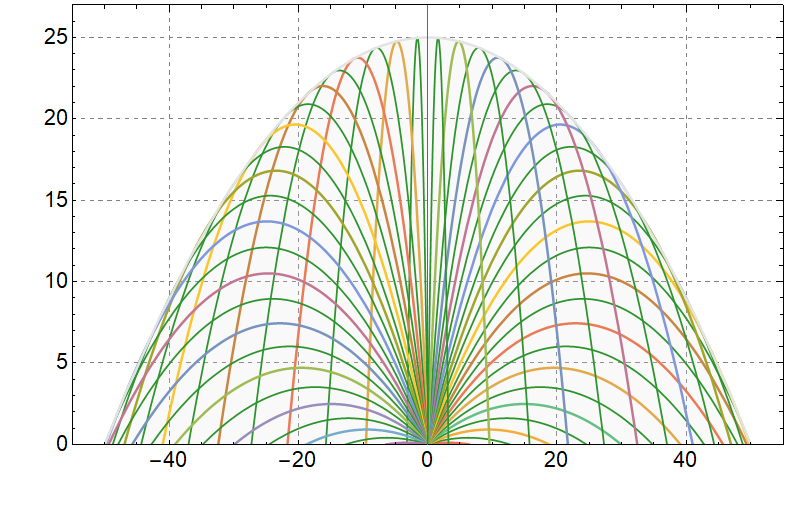

###  Условие:

$1.3.13^{*}.$ Снаряд, вылетев из орудия, попал в точку с координатами $x$ по горизонтали и $y$ по вертикали. Начальная скорость снаряда $v$. Найдите:
а) тангенс угла, образуемого стволом орудия с горизонтом;
б) границу области возможного попадания снаряда;
в) наименьшую начальную скорость снаряда, при которой он может попасть в точку с координатами $x, \\,y$.

Указание. При решении воспользуйтесь тригонометрическим тождеством $1/ \\cos^2 \\varphi = \\tan^2 \\varphi + 1$

###  Решение:

а) Воспользуемся формулой для траектории полета, полученной в [1.3.6](../1.3.6):

$$
y(x) = x \\tan\\varphi-\\frac{gx^2}{2v^2\\cos^2 \\varphi}\\tag{1}
$$

Воспользуемся подсказкой,

$$
y(x) = x \\tan\\varphi-\\frac{gx^2}{2v^2}(1+\\tan^2 \\varphi)\\tag{2}
$$

Откуда выражаем угол $ \\varphi$:

$$
\\tan\\varphi=\\frac{v^2\\pm\\sqrt{v^4-2gv^2y-g^2x^2}}{gx}\\tag{3}
$$

б) Изобразим множество траекторий, меняя угол $\\varphi$ от $-\\frac{\\pi}{2}$ до $\\frac{\\pi}{2}$:

Видим, что все эти траектории имеют общую огибающую, за которую снаряд при данной скорости не может вылететь ни при каком угле. И эта огибающая подозрительно напоминает параболу... Попробуем найти ее уравнение

Проанализировав область определения функции $(2)$, заметим, что подкоренное выражение не отрицательное

$$
v^4-2gv^2y-g^2x^2 \\geq 0 \\tag{4}
$$
Другими словами, $(4)$ - это условие, при котором существует угол, направив пушку под которым, можно попасть в точку $(x, y)$. Либо это условие наличия корней $(2)$. Перепишем это:

$$
y \\leq \\frac{v^2}{2g}-\\frac{gx^2}{2v^2}\\tag{5}
$$

Уравнение
$$
y = \\frac{v^2}{2g}-\\frac{gx^2}{2v^2}
$$
называют "параболой безопасности", оно описывает зону досягаемости орудия

в) 
Теперь мы сначала найдем зависимость необходимой для поражения цели скорости от угла выстрела, а потом - минимум этой функции.
Перепишем (1) в немного другом виде, домножив на $v^2\\cos^2 \\varphi$:

$$
y v^2\\cos^2 \\varphi = x v^2 \\sin\\varphi\\cos \\varphi-\\frac{gx^2}{2}
$$

$$
v^2 (\varphi)=\\frac{gx^2}{2(x\\sin\\varphi\\cos \\varphi-y \\cos^2 \\varphi)}\tag{6}
$$

В числителе константа, поэтому максимум знаменателя соответсвует минимуму функции (6). Ищем максимальное значение

$$
x\\sin\\varphi\\cos \\varphi-y \\cos^2 \\varphi=\frac{1}{2}\left(x\\sin2\\varphi- y\\cos2\\varphi -y \right)
$$
Задача сводится к нахождению максимального значения $x\\sin2\\varphi- y\\cos2\\varphi$. такое можно решать с помощью производной, но покажем для разнообразия тригонометрический метод (вспомогательного угла):
$$
x \sin 2\varphi - y \cos 2\varphi = \sqrt{x^2+y^2} \left( \frac{x}{\sqrt{x^2+y^2}}\sin 2\varphi - \frac{y}{\sqrt{x^2+y^2}}\cos 2\varphi \right) = \sqrt{x^2+y^2} \sin(2\varphi - \alpha) \le \sqrt{x^2+y^2}
$$

Подставляя все вместе:
$$
v^{2}_{min}=\\frac{\frac{1}{2}gx^2}{\frac{1}{2}(\\sqrt{x^2+y^2}-y)}=\frac{gx(\\sqrt{x^2+y^2}+y)}{x^2+y^2-y^2}
$$
$$
\\fbox{$v_{min}=\\sqrt{g(y+\\sqrt{x^2+y^2})}$}
$$

#### Ответ:

a) $\\tan\\varphi=\\frac{v^2\\pm\\sqrt{v^4-2gv^2y-g^2x^2}}{gx}.$
б) $y=\\frac{v^2}{2g}-\\frac{gx^2}{2v^2}$
в) $v_{\\text{мин}}=\\sqrt{g(y+\\sqrt{x^2+y^2})}$

