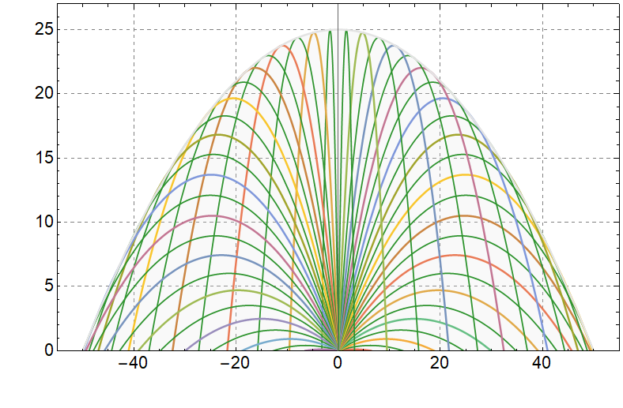

###  Условие: 

$1.3.13^{*}.$ Снаряд, вылетев из орудия, попал в точку с координатами $x$ по горизонтали и $y$ по вертикали. Начальная скорость снаряда $v$. Найдите: 

а) тангенс угла, образуемого стволом орудия с горизонтом; 

б) границу области возможного попадания снаряда; 

в) наименьшую начальную скорость снаряда, при которой он может попасть в точку с координатами $x, \,y$. 

Указание. При решении воспользуйтесь тригонометрическим тождеством $1/ \cos^2 \varphi = \tan^2 \varphi + 1$ 

###  Решение: 

а) Воспользуемся формулой для траектории полета, полученной в [1.3.6](../1.3.6):

$$y(x) = x \tan\varphi-\frac{gx^2}{2v^2\cos^2 \varphi}$$ 

Воспользуемся подсказкой,

$$y(x) = x \tan\varphi-\frac{gx^2}{2v^2}(1+\tan^2 \varphi)\quad(1)$$ 

Откуда выражаем угол $ \varphi$:

$$\tan\varphi=\frac{v^2\pm\sqrt{v^4-2gv^2y-g^2x^2}}{gx}$$ 

б) Изобразим множество траекторий, меняя угол $\varphi$ от $-\frac{\pi}{2}$ до $\frac{\pi}{2}$:

Проанализировав область определения функции $(1)$, подчеркнем, что подкоренное выражение не отрицательное

$v^4-2gv^2y-g^2x^2 \geq 0$ 

$$y \leq \frac{v^2}{2g}-\frac{gx^2}{2v^2}$$ 

в) Из $(1)$, получаем:

$$v_{x}v_{y}x-\frac{1}{2}gx^{2}=v_{x}^{2}y$$ 

Воспользуемся формулой для горизонтальной и вертикальной координат, полученной в [1.3.6](../1.3.6):

$$y(t) = vt \cdot \sin{\varphi} - \frac{gt^2}{2}$$ 

$x(t) = vt \cdot \cos{\varphi}$ 

Пусть $\xi =\cos{\varphi}$, 

$v_y = v \xi$ 

$v_x = v \sqrt{1-\xi^2}$ 

Получаем функцию 

$$v(\xi )=\frac{\sqrt{g}x}{\sqrt{2 \xi\sqrt{1-\xi^{2}}x-\xi^{2}y}} \quad(2)$$ 

Максимум подкоренного значения соответсвует минимуму функции (2)

$(\sqrt{x^{2}+y^{2}-y})/2 \rightarrow \max$ 

Минимум функции $(2)$

$$\fbox{$v^{2}=\frac{gx}{\sqrt{1+(\frac{y}{x})^{2}}-\frac{y}{x}}$}$$ 

####  Ответ: 

a) $\tan\varphi=\frac{v^2\pm\sqrt{v^4-2gv^2y-g^2x^2}}{gx}.$ 

б) $y=\frac{v^2}{2g}-\frac{gx^2}{2v^2}$ 

в) $v_{\text{мин}}=\sqrt{g(y+\sqrt{x^2+y^2})}$ 

  

