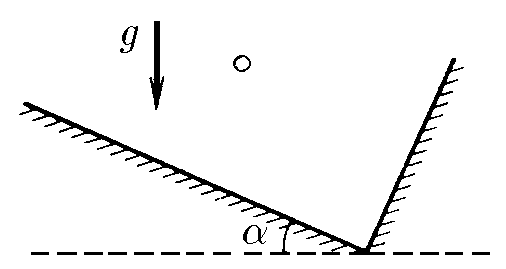
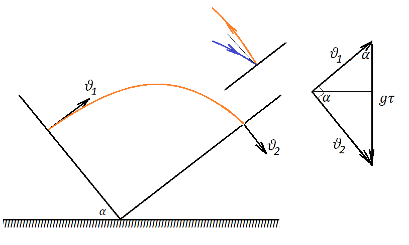

###  Условие:

$1.3.17.$ В прямоугольной коробке, упруго ударяясь о дно и правую стенку, по одной траектории туда и обратно прыгает шарик. Промежуток времени между ударами о дно и стенку равен $\Delta t$. Дно коробки образует угол $\alpha$ с горизонтом. Найдите скорости шарика сразу после ударов.

###  Решение:

Самое важное в этой задаче то, что шарик прыгает по одной и той же траектории. Действительно, при упругом ударе угол падения равен углу отскока. Если шарик падает на стенку коробки так, что его скорость не перпендикулярна стенке, то при отскоке его траектория отличалась бы от траектории подлета – я показала это дополнительным маленьким рисунком. Следовательно, $v_2$ перпендикулярен стенке. А это значит, что вектора скоростей $v_1$ и $v_2$ перпендикулярны друг другу.

Нарисуем треугольник скоростей.

Из него следует, что

$$
v_1 = g \tau\cos\alpha
$$

$$
v_2 = g \tau\sin\alpha
$$

####  Ответ: $v_{1}=g\Delta t\sin\alpha ,$ $v_{2}=g\Delta t\cos\alpha .$