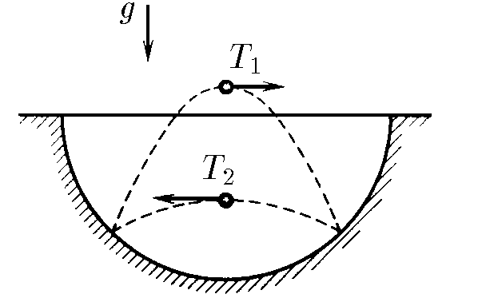
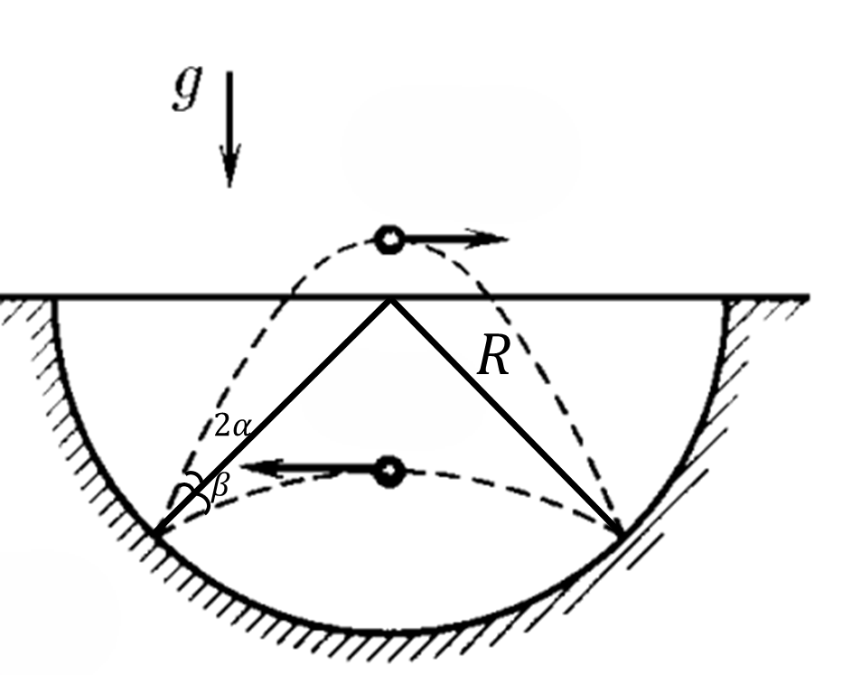

###  Условие: 

$1.3.18^*.$ В сферической лунке прыгает шарик, упруго ударяясь о ее стенки в двух точках, расположенных на одной горизонтали. Промежуток времени между ударами при движении шарика слева направо всегда равен $T_1$, а при движении справа налево — $T_2 \neq T_1$. Определите радиус лунки. 

### Решение:

 

a) Найдем радиус лунки, являющейся перпендикулярной к поверхности лунки в точках удара и удар абсолютно упругий, то углы между векторами скорости шарика в моменты удара и отскока одинаковы. Поэтом наша задача аналогична тому, что из точки $O$ (см. рис.) одновременно бросают два тела с равными начальными скоростями oo под углами к горизонту $\beta$ и $( \beta + 2 \alpha )$ соответственно, причем дальность полета обоих случаев одинакова.

$$S = \frac{ v_{0}^{2} \sin 2 \beta}{g} = \frac{ v_{0}^{2} \sin 2 ( \beta + 2 \alpha ) }{g}$$ 

Откуда получим:

$$\sin 2 \beta = \sin 2( \beta + 2 \alpha )$, или $\beta + \alpha = 45^{ \circ}$$ 

Тогда радиус лунки можно определить как:

$$R= \frac{\frac{1}{2}S}{ \cos ( \beta + \alpha ) } = \frac{S}{ \sqrt{2} }$$ 

Для определения дальности полета $S$ запишем уравнения движения тела в проекции на ось $Ox$ системы координат:

$$x_{1} = v_{0} \cos\beta t - \frac{1}{2} gt^{2}, x_{2} = v_{0} \cos ( \beta + 2 \alpha )t - \frac{1}{2} gt^{2}$$ 

В моменты времени $T_{1}$ и $T_{2}$ координаты $x_{1}$ и $x_{2}$ становятся равны нулю. Поэтому:

$$0 = v_{0} \cos\beta T_{1} - 1 /2 gT_{1}^{2}$$ 

$$0 = v_{0} \cos( \beta + 2 \alpha ) T_{2} - \frac{1}{2} gT_{2}^{2}$$ 

или с учетом, что $\alpha = 45^{ \circ} - \beta$:

$$v_{0} \cos\beta = \frac{1}{2} gT_{1}, v_{0} \sin\beta = \frac{1}{2} gT_{2}$$ 

Перемножая последние соотношения, получим:

$$v_{0}^{2} \sin\beta\cos\beta = \frac{1}{4} g^{4}T_{1}T_{2}$$ 

Следовательно, дальность полета равна:

$$S = \frac{v_{0}^{2} \sin 2 \beta}{g} = \frac{gT_{1}T_{2} }{2}$$ 

а радиус лунки:

$$R = \frac{S}{ \sqrt{2}} = \frac{gT_{1}T_{2} }{2 \sqrt{2} }$$ 

####  Ответ: $R = gT_1T_2/(2\sqrt{2})$ 

###  Альтернативное решение: 

   

