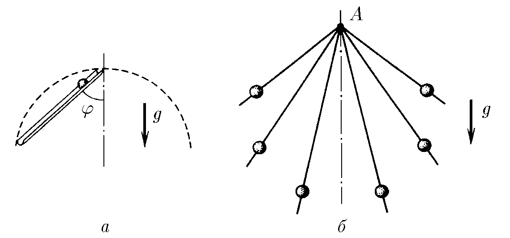
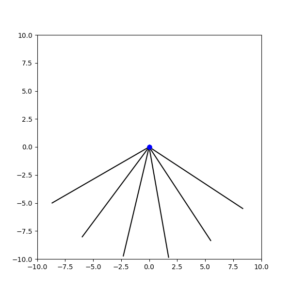

###  Условие: 

$1.3.2.$ а. Из верхней точки окружности по гладкому желобу под углом $\varphi$ к вертикали начинает скользить шарик. За какое время он достигнет окружности, если ее диаметр $D$?
б. Из точки $A$ по спицам с разным наклоном одновременно начинают скользить без трения маленькие бусинки. На какой кривой будут находиться бусинки в момент времени $t$? 

###  Решение: 

а) По гладкому желобу шарик будет двигаться с ускорением, равным проекции ускорения свободного падения на направление движения, т.е. 

$$a = g \cdot\cos{\varphi }$$ 

Перемещение шарика представляет собой хорду окружности диаметром $D$, величина которой связана с диаметром, следующим соотношением 

$$r = D \cdot\cos{\varphi }$$ 

Запишем далее уравнение ускоренного движения шарика и из него найдём время движения 

$${r=\frac{at^{2}}{2},\quad D\cos\varphi=\frac{g\cos\varphi}{2}t^{2},\quad t=\sqrt{\frac{2D}{g}} .}$$ 

$$\fbox{ $t=\sqrt{\frac{2D}{g}}$ } \quad (1)$$ 

б) Заметим, что в выражении $(1)$ не входит значение угла, следовательно все шарики будут опускаться одновременно. И будут лежать на окружности радиуса $r = g t^2/2$, как показано на анимации 

####  Ответ: 
а. $t = \sqrt{2D/g}$
б. На окружности радиуса $gt^{2}/2$ с верхней точкой $A.$ 

  

