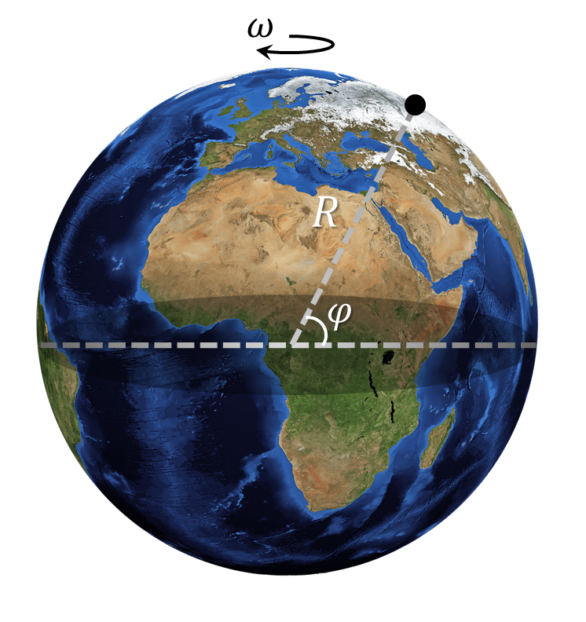

###  Условие: 

$1.3.20$. Определите скорость и ускорение, которыми обладают точки земной поверхности на экваторе и в Санкт-Петербурге из-за участия Земли в суточном вращении. Радиус Земли принять равным $6400 \,км$. Широта Санкт-Петербурга $60^{\circ}.$ 

###  Решение: 

Земля вращается вокруг своей оси с периодом в $T = 24\;ч$. Таким образом, цикловая частота вращения состваляет 

$$\omega = \frac{2 \pi}{T} = 7.3 \cdot 10^{-5} \; c^{-1}$$ 

На экваторе $\varphi = 0^{\circ}$, расстояние до оси вращение составляет $r =R$. А скорость будет равна 

$v = \omega R=1675\text{ км/ч, }$ 

Ускорение, связанное с суточным вращением, найдем как 

$a = \omega^2 R=0{,}034\text{ м/c}^2$ 

На широте $\varphi = 60^{\circ}$, расстояние до оси вращение составляет $r =R\cdot \cos\varphi$. А скорость будет равна 

$v = \omega R\cdot \cos\varphi=838\text{ км/ч, }$ 

Ускорение, связанное с суточным вращением, найдем как 

$a = \omega^2 R\cdot \cos\varphi=0{,}017\text{ м/c}^2$ 

####  Ответ: 

$\begin{array}{l}v_\text{э}=1675\text{ км/ч, }a_\text{э}=0{,}034\text{ м/c}^2.\\\v_{\text{л}}=838\text{ км/ч, }a_{\text{л}}=0{,}017\text{ м/c}^2.\end{array}$ 

  

