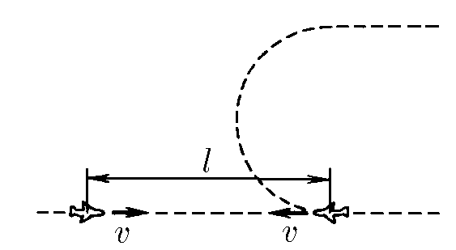

###  Условие:

$1.3.22^*.$ Самолеты летят по одной прямой навстречу друг другу с одинаковой скоростью $v$. Предельная дальность обнаружения ими друг друга $l$. Один самолет после обнаружения другого совершает разворот, не меняя модуля скорости, и летит параллельно второму самолету. При каком постоянном ускорении самолеты потеряют друг друга из вида в конце разворота?

### Решение:

Чтобы самолеты потеряли друг друга необходимо, чтобы к концу разворота расстояние между ними состовляло $l$

По оси $Oy$ - второй самолет сместиться на величину двойного радиуса-кривизны траектории разворота, а первый самолет сместиться за время $t$ на величину $vt$ по оси $Ox$.

Запишем условие потери из виду

$$
(2r)^2 + (l-vt)^2 = l^2\tag{1}
$$

Т.к. скорость остается неизменной $v = \text{сonst}$

$$
vt = \pi r\tag{2}
$$

Подcтавляем $(2)$ в $(1)$

$$
(4+\pi^2)r^2 - 2l \pi r = 0\tag{3}
$$

Выражаем $r$

$$
r = l \frac{2 \pi}{4+\pi^2}\tag{4}
$$

Тогда, ускорение, с которым движется второй самолет

$$
a = \frac{v^2}{r} = \frac{v^2}{l} \frac{4+\pi^2}{2 \pi}\tag{5}
$$

###  Альтернативное решение:

#### Ответ: $a < (4 + \pi^2) v^2/(2\pi l)$