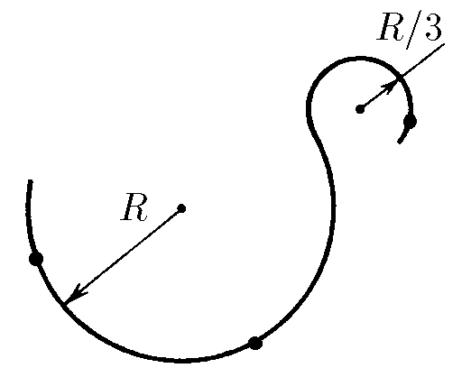

###  Условие: 

$1.3.23.$ Небольшое тело движется с постоянной скоростью $v$ по траектории, состоящей из двух плавно соединенных дуг окружностей радиуса $R$ и $R/3$. Постройте векторы ускорения в отмеченных точках траектории. 

### Решение:

 

Ускорение направлено вдоль радиуса-кривизны траектории и равно

$$\fbox{$ a = \frac{v^2}{r}$}$$ 

  

