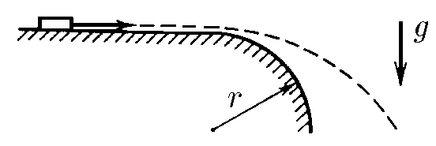

###  Условие:

$1.3.26.$ Край гладкого горизонтального стола скруглен по окружности радиуса $r$. С какой наименьшей скоростью нужно пустить по столу малое тело, чтобы оно, достигнув скругления, сразу полетело по параболе?

### Решение:

Чтобы тело полетело по параболе, необходимо чтобы в момент отрыво оно находилось в состоянии невесомости

Сила тяжести будет компенсироваться центробежной силой

$$
mg = \frac{mv^2}{r}
$$

Откуда выражаем $v$

$$
v = \sqrt{gr}
$$

####  Ответ: $v = \sqrt{gr}$