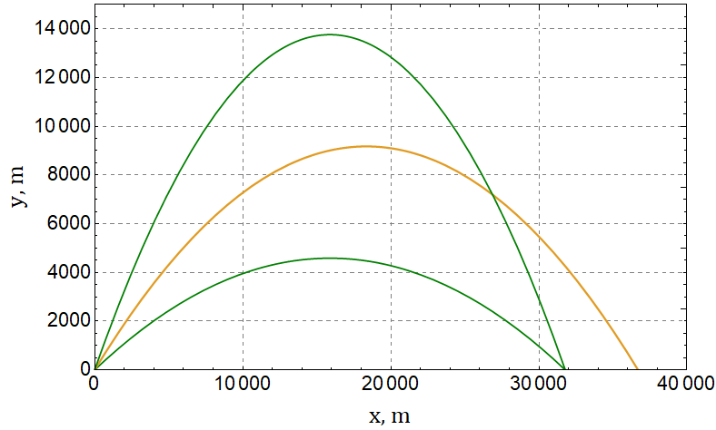

###  Условие:

$1.3.28.$ Снаряды вылетают с начальной скоростью $v_0 = 600$ м/с под углом $30^{\circ}$, $45^{\circ}$, $60^{\circ}$ к горизонту. Определите радиус кривизны траектории снарядов в их наивысшей и начальной точках.

###  Решение:

В начальный момент времени, нормальная составляющая $\vec{g}$, перпендикулярная $\vec{v}$:

$$
g_\perp = g \cos\alpha
$$

Тогда радиус-кривизны в начальной точке найдем как

$$
\fbox{$R = \frac{v^2}{g \cos\alpha}$}
$$

В верхней точке траектории, ускорение будет совпадать с ускорением свободного падения, а скорость будет равняться горизонтальной

$$
g_\perp = g
$$

$$
v = v_0 \cos\alpha
$$

Аналогично, радиус-кривизны в этой точке находим как

$$
\fbox{$R = \frac{v^2 \cos^2 \alpha}{g}$}
$$

####  Ответ: $27.5\text{ м }42.4\text{ км; }18.3\text{ м }52\text{ км; }0.2\text{ м }73.4\text{ км}.$

### Альтернативное решение:

