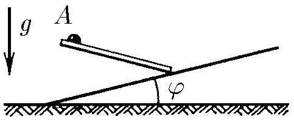

###  Условие: 

$1.3.3^*.$ Под каким углом к вертикали должен быть направлен из точки $A$ гладкий желоб, чтобы шарик соскользнул по нему на наклонную плоскость за наименьшее время? 

###  Решение: 

Рассмотрим возможные направления желоба из точки $A$. Видно, что меняя угол наклона желоба к плоскости меняется и длина желоба, но также изменяется и ускорение с которым шарик будет двигаться по желобу. 

Из геометрических соображений: 

$$h = x \cdot \tan{\alpha} + x \cdot \tan{\varphi}$$ 

$$l = \frac{x}{\cos{\alpha}}\quad (1)$$ 

Шарик будет скатываться с ускорением: 

$$a = g \cdot \sin{\alpha}$$

Время находим из условия, что шарик прошёл путь $l$: 

$$l = \frac{a t^2}{2}$$ 

$$\frac{x}{\cos{\alpha}} = \frac{g \cdot \sin{\alpha} \cdot t^2}{2}$$ 

Следовательно, выражая $x$ из $(1)$, получаем из последнего уравнения: 

$$t^2 = \frac{2h}{g \cdot \sin{\alpha} \cdot \cos{\alpha} (\tan{\alpha} + \tan{\varphi})}$$ 

Время будет минимальным, если $\xi =g \cdot \sin{\alpha} \cdot \cos{\alpha} (\tan{\alpha} + \tan{\varphi})$ будет максимальным. 

$$\xi = \frac{\sin{\alpha}}{\cos{\varphi}} \sin{(\alpha + \varphi)} $$ 

$$\xi = \frac{1}{2 \cos{\varphi}} (\cos{\varphi} - \cos{(2\alpha + \varphi)})$$ 

Это выражение будет максимальным, когда $\cos{(2\alpha + \varphi)}$ будет минимальным, а значит равно $-1$. Тогда $2\alpha + \varphi = \pi$, откуда: 

$$\alpha = \frac{\pi}{2} - \frac{\varphi}{2}$$ 

Угол желоба к вертикали равен: 

$$\beta = \frac{\pi}{2} - \alpha$$ 

$$\fbox{$\beta =\frac{\varphi}{2}$}$$ 

####  Ответ: угол желоба к вертикали, при котором шарик соскальзывает за наименьшее время равен $\frac{\varphi}{2}$. 

  

