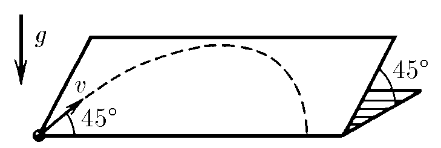

###  Условие: 

$1.3.7.$ По гладкой наклонной плоскости со скоростью $v$ пускают шарик. Какое расстояние по горизонтали он пройдет, прежде чем скатится с плоскости? Плоскость наклонена к горизонту под углом $45^{\circ}$. Начальная скорость шарика образует угол $45^{\circ}$ с горизонтальным краем плоскости падения на Земле? 

###  Решение: 

На наклонной плоскости на тело действует компонента ускорения свободного падения: 

$$a = g^* = g \cdot \cos{45^{\circ}}$$ 

Из формулы для дальности полета, полученной в [1.3.6](../1.3.6) следует: 

$$L=\frac{v^2}{g^*}\operatorname{sin}90^{\circ}$$ 

Подставляем $g^*$: 

$$\fbox{$L=\frac{v^2 \sqrt{2}}{g}$}$$ 

####  Ответ: $L= \sqrt {2} v^{2} / g$ 

  

