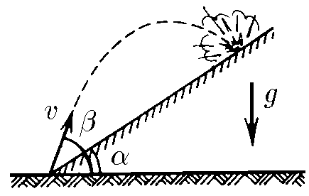

###  Условие:

$1.3.8.$ Из миномета ведут стрельбу по объектам, расположенным на склоне горы. На каком расстоянии от миномета будут падать мины, если их начальная скорость $v$, угол наклона горы $\alpha$ и угол стрельбы по отношению к горизонту $\beta$?

###  Решение:

Уравнения движения снаряда могут быть записаны следующим образом:

$$
{x}={v}_{0}{t}\cos{\beta}
$$

$$
{y}={v}_{0}{t}\sin{\beta}-\frac{{g}{t}^{2}}{2}
$$

Подставим в уравнения координаты цели $x = L; \;y = L \tan\alpha$

$$
{L=v_{0}t\cos\beta}
$$

$$
L\tan\alpha =v_{0}t\sin\beta -\frac{gt^{2}}{2}
$$

Выразим из первого уравнения последней системы уравнений время и подставим его значение во второе уравнение

$$
{t=\frac{L}{v_{0}\cos\beta}}
$$

$$
{L\tan\alpha =v_{0}\frac{L}{v_{0}\cos\beta}\sin\beta -\frac{g}{2}\frac{L^{2}}{v_{0}^{2}\cos^{2}\beta} }
$$

Откуда

$$
{v}_{0}=\sqrt{\frac{{gL}\cos\alpha}{2\cos\beta\sin(\beta -\alpha )}}
$$

Выражаем $L$,

$$
L = \frac{ 2\cos\beta\sin(\beta -\alpha )\cdot v^2_0}{g\cos\alpha}
$$

И находим дальность полета вдоль стенки:

$$
l = \frac{L}{\cos\alpha}
$$

$$
\fbox{$l = \frac{ 2v^2_0}{g} \frac{ \cos\beta\sin(\beta -\alpha )}{\cos^2 \alpha}$}
$$

####  Ответ: $L=\frac{2v^2}g\frac{\cos^2 \beta}{\cos\alpha}(\text{tg}\beta -\text{tg}\alpha )$