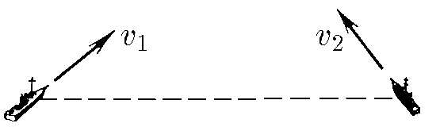

###  Условие:

$1.4.1.$ Начальные положения и скорости двух кораблей заданы на рисунке. Корабли движутся без ускорения. Как найти наименьшее расстояние между ними?

###  Решение:

В системе отсчета второго корабля первый движется по прямой вдоль вектора $v_1 − v_2$.

Перпендикуляр, опущенный на эту прямую из местонахождения второго корабля, и будет наименьшим расстоянием.